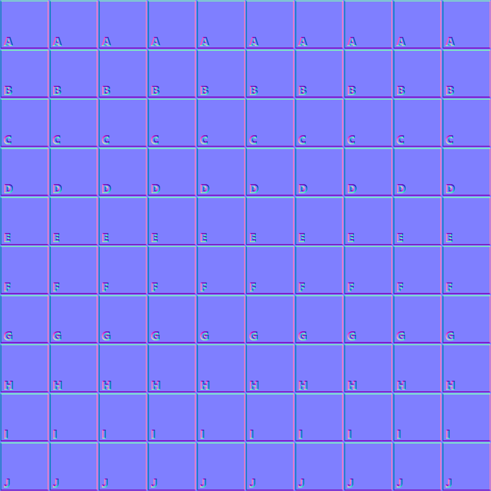

The following table shows the properties that are set for every model.  

Attribute | **Values**
:---: | :---:
Metallic Factor | 0.0
 
The following table shows the properties that are set for a given model.  

Index | Emissive Factor | Emissive Texture | Normal Texture | Normal Texture Scale | Occlusion Texture | Occlusion Texture Strength
:---: | :---: | :---: | :---: | :---: | :---: | :---:
[0](./Material_0.gltf) |   |   |   |   |   |  
[1](./Material_1.gltf) | [0.0, 0.0, 1.0] |  |  | 2.0 |  | 0.5
[2](./Material_2.gltf) | [0.0, 0.0, 1.0] |   |   |   |   |  
[3](./Material_3.gltf) | [0.0, 0.0, 1.0] |  |   |   |   |  
[4](./Material_4.gltf) |   |   |  |   |   |  
[5](./Material_5.gltf) |   |   |  | 2.0 |   |  
[6](./Material_6.gltf) |   |   |   |   |  |  
[7](./Material_7.gltf) |   |   |   |   |  | 0.5
