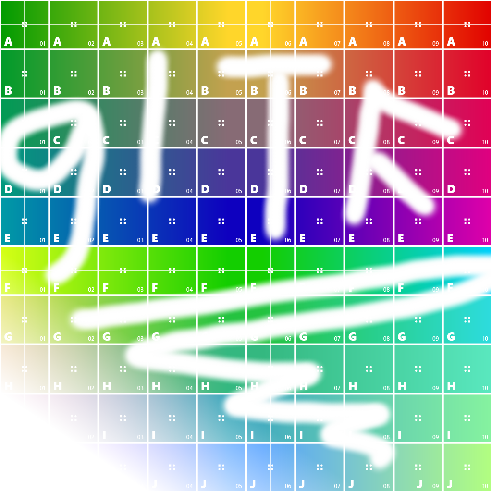

The following table shows the properties that are set for every model.  

Attribute | **Values**
:---: | :---:
Base Color Texture | 
 
The following table shows the properties that are set for a given model.  

Index | Alpha Mode | Alpha Cutoff | Double Sided | Alpha Mode
:---: | :---: | :---: | :---: | :---:
[0](./Material_Alpha_0.gltf) |   |   |   |  
[1](./Material_Alpha_1.gltf) | Mask | 0.0 | True | [1.0, 1.0, 1.0, 0.6]
[2](./Material_Alpha_2.gltf) | Mask |   |   |  
[3](./Material_Alpha_3.gltf) | Mask |   |   | [1.0, 1.0, 1.0, 0.6]
[4](./Material_Alpha_4.gltf) | Mask |   | True |  
[5](./Material_Alpha_5.gltf) | Mask | 0.0 |   |  
[6](./Material_Alpha_6.gltf) | Blend |   |   |  
[7](./Material_Alpha_7.gltf) | Blend |   | True |  
[8](./Material_Alpha_8.gltf) |   |   | True |  
