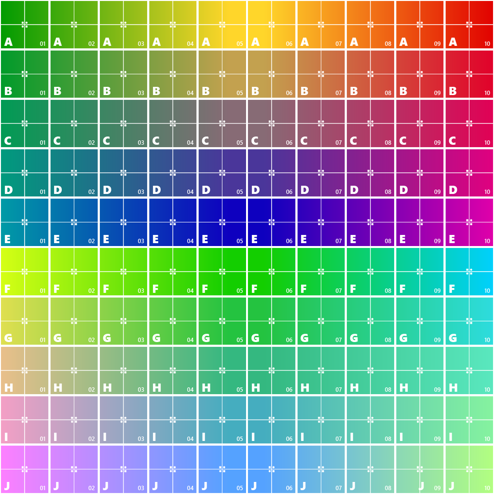
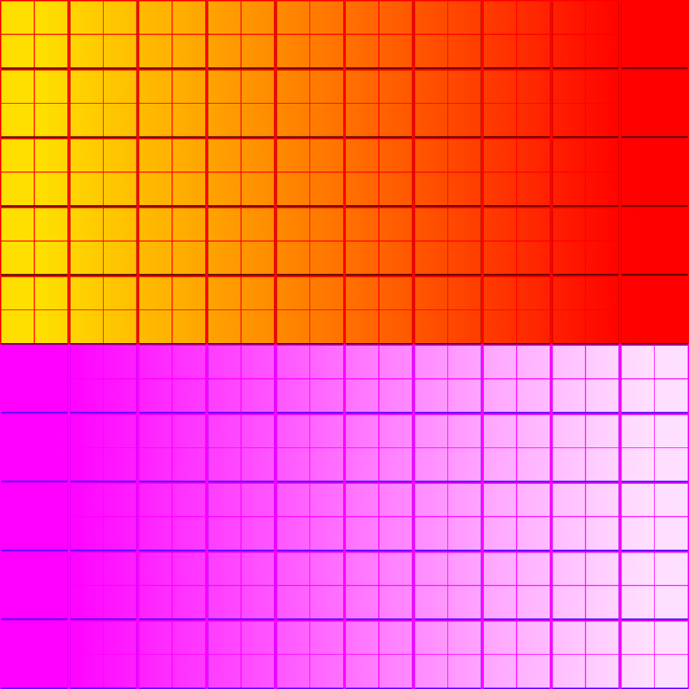

No attributes are explicitly set in every model generated by this test, other than those in the base model.  
 
The following table shows the properties that are set for a given model.  

Index | Base Color Factor | Base Color Texture | Metallic Factor | Roughness Factor | Metallic Roughness Texture
:---: | :---: | :---: | :---: | :---: | :---:
[0](./Material_MetallicRoughness_0.gltf) |   |   |   |   |  
[1](./Material_MetallicRoughness_1.gltf) | [1.0, 0.0, 0.0, 0.8] |  | 0.5 | 0.5 | 
[2](./Material_MetallicRoughness_2.gltf) | [1.0, 0.0, 0.0, 0.8] |   |   |   |  
[3](./Material_MetallicRoughness_3.gltf) |   |  |   |   |  
[4](./Material_MetallicRoughness_4.gltf) | [1.0, 0.0, 0.0, 0.8] |  |   |   |  
[5](./Material_MetallicRoughness_5.gltf) |   |   | 0.5 |   |  
[6](./Material_MetallicRoughness_6.gltf) |   |   |   | 0.5 |  
[7](./Material_MetallicRoughness_7.gltf) |   |   |   |   | 
[8](./Material_MetallicRoughness_8.gltf) |   |   |   | 0.5 | 
[9](./Material_MetallicRoughness_9.gltf) |   |   | 0.5 |   | 
[10](./Material_MetallicRoughness_10.gltf) |   |   | 0.5 | 0.5 | 
