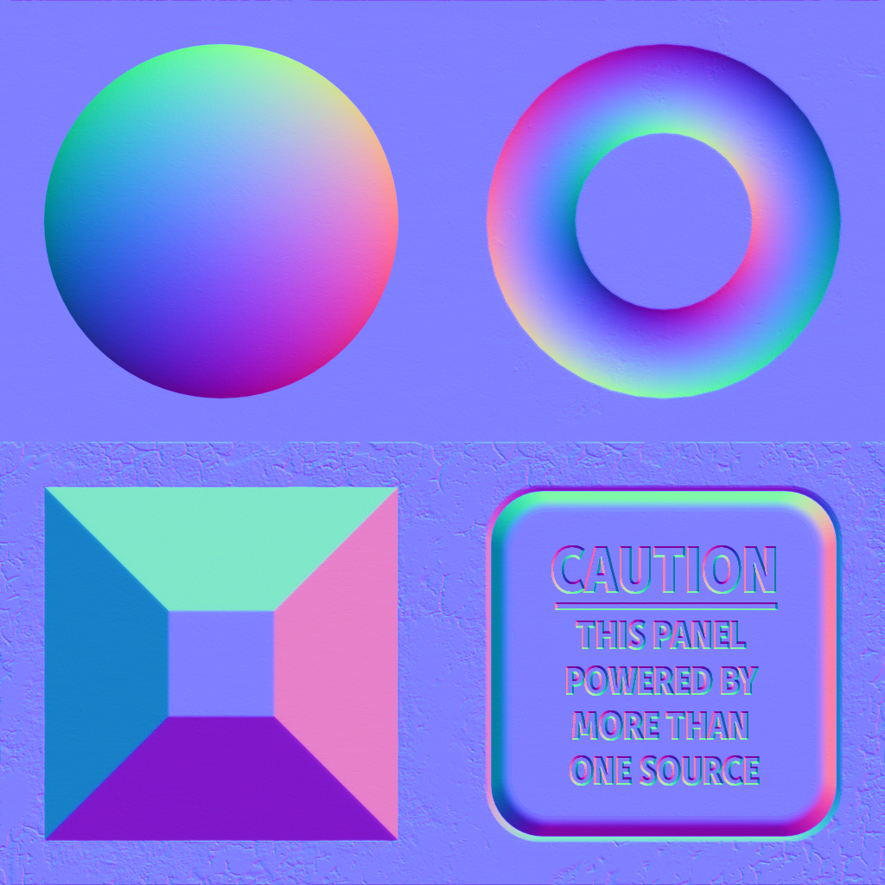
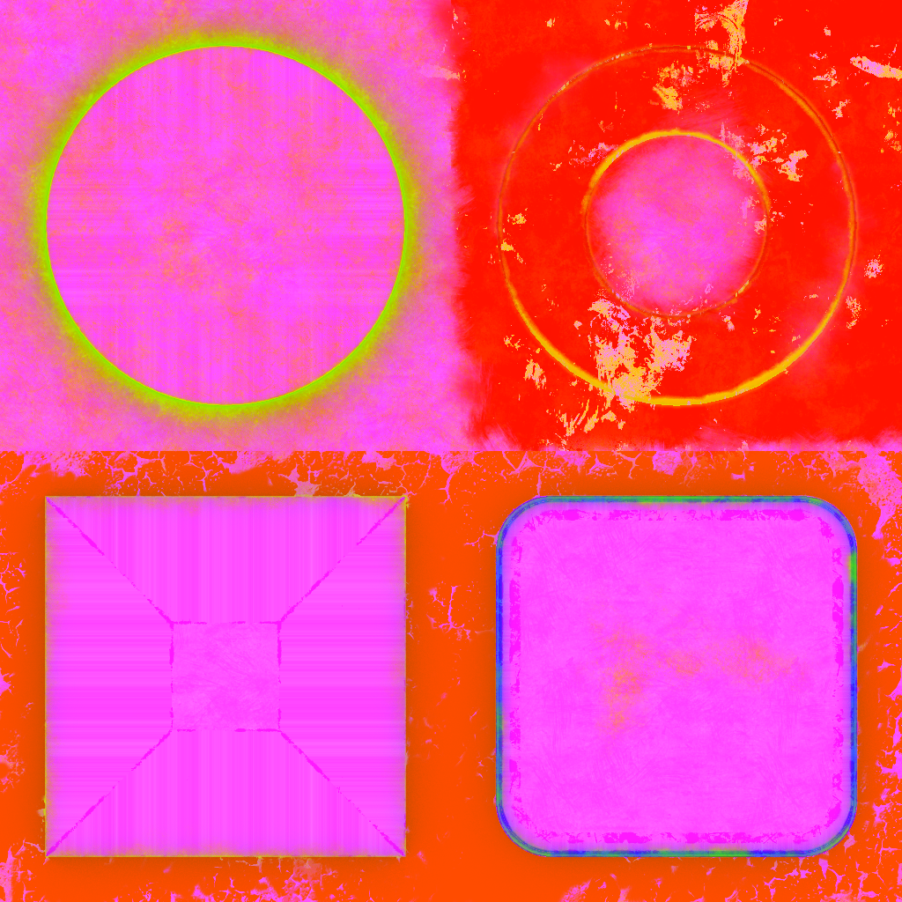

The following table shows the properties that are set for every model.  

Attribute | **Values**
:---: | :---:
Base Color Texture | 
 
The following table shows the properties that are set for a given model.  
All values of Byte and Short are normalized unsigned.  

Index | Normal | Normal Texture | Tangent | Tex Coord 0 | Tex Coord 1 | Color | Base Color Texture | Metallic Roughness Texture
:---: | :---: | :---: | :---: | :---: | :---: | :---: | :---: | :---:
[00](./Primitive_Attribute_0.gltf) |   |   |   |   |   |   |   |  
[01](./Primitive_Attribute_1.gltf) | :white_check_mark: |  | :white_check_mark: | Float | Float | Vector3 Float |  | 
[02](./Primitive_Attribute_2.gltf) | :white_check_mark: |   |   |   |   |   |  |  
[03](./Primitive_Attribute_3.gltf) | :white_check_mark: |  |   |   |   |   |  |  
[04](./Primitive_Attribute_4.gltf) | :white_check_mark: |  | :white_check_mark: |   |   |   |  |  
[05](./Primitive_Attribute_5.gltf) |   |   |   | Float |   |   |  |  
[06](./Primitive_Attribute_6.gltf) |   |   |   | Float | Float |   |  | 
[07](./Primitive_Attribute_7.gltf) |   |   |   | Byte |   |   |  |  
[08](./Primitive_Attribute_8.gltf) |   |   |   | Byte | Byte |   |  | 
[09](./Primitive_Attribute_9.gltf) |   |   |   | Byte | Byte | Vector3 Byte |  | 
[10](./Primitive_Attribute_10.gltf) |   |   |   | Byte | Byte | Vector4 Byte |  | 
[11](./Primitive_Attribute_11.gltf) |   |   |   | Short |   |   |  |  
[12](./Primitive_Attribute_12.gltf) |   |   |   | Short | Short |   |  | 
[13](./Primitive_Attribute_13.gltf) |   |   |   | Short | Short | Vector3 Short |  | 
[14](./Primitive_Attribute_14.gltf) |   |   |   | Short | Short | Vector4 Short |  | 
[15](./Primitive_Attribute_15.gltf) |   |   |   |   |   | Vector3 Float |  |  
[16](./Primitive_Attribute_16.gltf) |   |   |   |   |   | Vector3 Byte |  |  
[17](./Primitive_Attribute_17.gltf) |   |   |   |   |   | Vector3 Short |  |  
[18](./Primitive_Attribute_18.gltf) |   |   |   |   |   | Vector4 Float |  |  
[19](./Primitive_Attribute_19.gltf) |   |   |   |   |   | Vector4 Byte |  |  
[20](./Primitive_Attribute_20.gltf) |   |   |   |   |   | Vector4 Short |  |  
