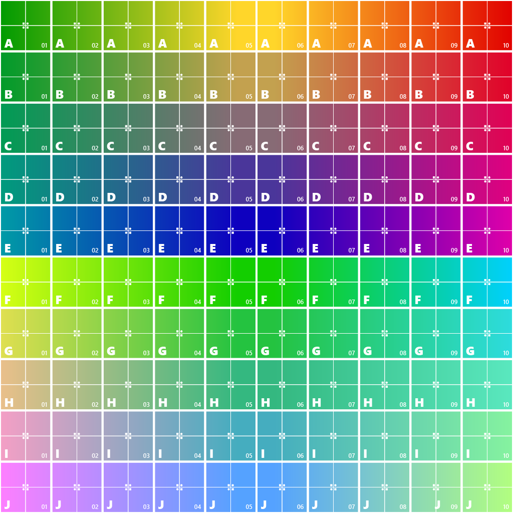

The following table shows the properties that are set for every model.  

Attribute | **Values**
:---: | :---:
Base Color Texture | 
Metallic Roughness Texture | 
Tex Coord | :white_check_mark:
 
The following table shows the properties that are set for a given model.  
All values of Byte and Short are normalized unsigned.  

Index | Normal | Tangent | Tex Coord 0 | Tex Coord 1 | Color
:---: | :---: | :---: | :---: | :---: | :---:
[0](./Primitive_Attribute_0.gltf) |   |   |   |   |  
[1](./Primitive_Attribute_1.gltf) | :white_check_mark: | :white_check_mark: | Float | Float | Vector3 Float
[2](./Primitive_Attribute_2.gltf) | :white_check_mark: |   |   |   |  
[3](./Primitive_Attribute_3.gltf) | :white_check_mark: | :white_check_mark: |   |   |  
[4](./Primitive_Attribute_4.gltf) |   |   | Float |   |  
[5](./Primitive_Attribute_5.gltf) |   |   | Float | Float |  
[6](./Primitive_Attribute_6.gltf) |   |   | Byte |   |  
[7](./Primitive_Attribute_7.gltf) |   |   | Byte | Byte |  
[8](./Primitive_Attribute_8.gltf) |   |   | Byte | Byte | Vector3 Byte
[9](./Primitive_Attribute_9.gltf) |   |   | Byte | Byte | Vector4 Byte
[10](./Primitive_Attribute_10.gltf) |   |   | Short |   |  
[11](./Primitive_Attribute_11.gltf) |   |   | Short | Short |  
[12](./Primitive_Attribute_12.gltf) |   |   | Short | Short | Vector3 Short
[13](./Primitive_Attribute_13.gltf) |   |   | Short | Short | Vector4 Short
[14](./Primitive_Attribute_14.gltf) |   |   |   |   | Vector3 Float
[15](./Primitive_Attribute_15.gltf) |   |   |   |   | Vector3 Byte
[16](./Primitive_Attribute_16.gltf) |   |   |   |   | Vector3 Short
[17](./Primitive_Attribute_17.gltf) |   |   |   |   | Vector4 Float
[18](./Primitive_Attribute_18.gltf) |   |   |   |   | Vector4 Byte
[19](./Primitive_Attribute_19.gltf) |   |   |   |   | Vector4 Short
