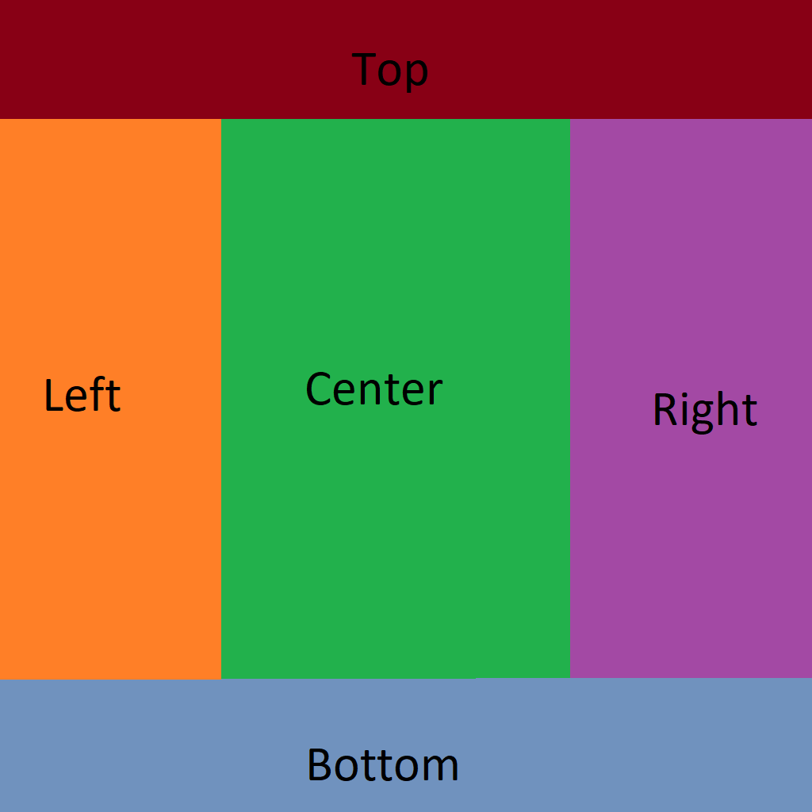

The following table shows the properties that are set for every model.  

Attribute | **Values**
:---: | :---:
Base Color Texture | 
Tex Coord | :white_check_mark:
 
The following table shows the properties that are set for a given model.  

Index | Mag Filter | Min Filter | Wrap S | Wrap T
:---: | :---: | :---: | :---: | :---:
[0](./Texture_Sampler_0.gltf) |   |   |   |  
[1](./Texture_Sampler_1.gltf) | Nearest | Nearest | Clamp To Edge | Clamp To Edge
[2](./Texture_Sampler_2.gltf) | Nearest |   |   |  
[3](./Texture_Sampler_3.gltf) | Linear |   |   |  
[4](./Texture_Sampler_4.gltf) |   | Nearest |   |  
[5](./Texture_Sampler_5.gltf) |   | Linear |   |  
[6](./Texture_Sampler_6.gltf) |   | Nearest Mipmap Nearest |   |  
[7](./Texture_Sampler_7.gltf) |   | Linear Mipmap Nearest |   |  
[8](./Texture_Sampler_8.gltf) |   | Nearest Mipmap Linear |   |  
[9](./Texture_Sampler_9.gltf) |   | Linear Mipmap Linear |   |  
[10](./Texture_Sampler_10.gltf) |   |   | Clamp To Edge |  
[11](./Texture_Sampler_11.gltf) |   |   | Mirrored Repeat |  
[12](./Texture_Sampler_12.gltf) |   |   |   | Clamp To Edge
[13](./Texture_Sampler_13.gltf) |   |   |   | Mirrored Repeat
