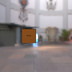
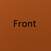
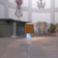
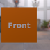
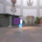

These models are intended to test the basic attributes of animation on a node.  

The last model on this list creates a curve which doesn't start at Zero.  

The following table shows the properties that are set for a given model.  

|   | Sample Image | Translation | Rotation | Scale | Interpolation |
| :---: | :---: | :---: | :---: | :---: | :---: |
| [00](Animation_Node_00.gltf) [View](https://bghgary.github.io/glTF-Assets-Viewer/?folder=0&model=0) |  | :white_check_mark: |   |   | Linear |
| [01](Animation_Node_01.gltf) [View](https://bghgary.github.io/glTF-Assets-Viewer/?folder=0&model=1) |  |   | :white_check_mark: |   | Linear |
| [02](Animation_Node_02.gltf) [View](https://bghgary.github.io/glTF-Assets-Viewer/?folder=0&model=2) |  |   |   | :white_check_mark: | Linear |
| [03](Animation_Node_03.gltf) [View](https://bghgary.github.io/glTF-Assets-Viewer/?folder=0&model=3) |  | :white_check_mark: |   |   | Step |
| [04](Animation_Node_04.gltf) [View](https://bghgary.github.io/glTF-Assets-Viewer/?folder=0&model=4) |  | :white_check_mark: |   |   | Cubic Spline |
| [05](Animation_Node_05.gltf) [View](https://bghgary.github.io/glTF-Assets-Viewer/?folder=0&model=5) |  |   | :white_check_mark: |   | Cubic Spline |
| [06](Animation_Node_06.gltf) [View](https://bghgary.github.io/glTF-Assets-Viewer/?folder=0&model=6) |  | :white_check_mark: | :white_check_mark: | :white_check_mark: | Linear |
| [07](Animation_Node_07.gltf) [View](https://bghgary.github.io/glTF-Assets-Viewer/?folder=0&model=7) |  |   | :white_check_mark: |   | Linear |
 
