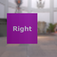
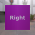
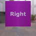

These models are intended to test edge cases of an animation on a node.  

The following table shows the properties that are set for a given model.  

|   | Sample Image | Description |
| :---: | :---: | :---: |
| [00](Animation_NodeMisc_00.gltf) [View](https://bghgary.github.io/glTF-Assets-Viewer/?folder=1&model=0) |  | Multiple channels are used, each with the same start and end time. |
| [01](Animation_NodeMisc_01.gltf) [View](https://bghgary.github.io/glTF-Assets-Viewer/?folder=1&model=1) |  | The time of the first keyframe does not start at zero. |
| [02](Animation_NodeMisc_02.gltf) [View](https://bghgary.github.io/glTF-Assets-Viewer/?folder=1&model=2) |  | There are two channels. The first channel has a constant transform value and starts after the second channel. The second channel is a rotation who's keyframe starts above zero and ends before the other channel. |
| [03](Animation_NodeMisc_03.gltf) [View](https://bghgary.github.io/glTF-Assets-Viewer/?folder=1&model=3) |  | The channel has only one keyframe. |
| [04](Animation_NodeMisc_04.gltf) [View](https://bghgary.github.io/glTF-Assets-Viewer/?folder=1&model=4) |  | There are two channels, the first targeting rotation and the second scale. The rotation is applied to the left node, and the scale to the right node. |
 
