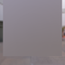
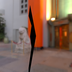
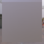
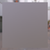

These models are intended to test using skin joints and weights.  

The following table shows the properties that are set for a given model.  

|   | Sample Image | Description |
| :---: | :---: | :---: |
| [00](Animation_Skin_00.gltf) [View](https://bghgary.github.io/glTF-Assets-Viewer/?folder=2&model=0) |  | Skin with two joints. |
| [01](Animation_Skin_01.gltf) [View](https://bghgary.github.io/glTF-Assets-Viewer/?folder=2&model=1) |  | Skin with two joints, one of which is animated with a rotation. |
| [02](Animation_Skin_02.gltf) [View](https://bghgary.github.io/glTF-Assets-Viewer/?folder=2&model=2) |  | Skin with two joints. The skin node has a transformation which is overridden by the joints. |
| [03](Animation_Skin_03.gltf) [View](https://bghgary.github.io/glTF-Assets-Viewer/?folder=2&model=3) |  | Skin with two joints. The skin node has a parent with a transformation which is overridden by the joints. |
| [04](Animation_Skin_04.gltf) [View](https://bghgary.github.io/glTF-Assets-Viewer/?folder=2&model=4) |  | Skin with two joints. The root joint is not the root node. |
| [05](Animation_Skin_05.gltf) [View](https://bghgary.github.io/glTF-Assets-Viewer/?folder=2&model=5) |  | Skin with five joints, all of which animate their respective vertex with a weight of 1. |
| [06](Animation_Skin_06.gltf) [View](https://bghgary.github.io/glTF-Assets-Viewer/?folder=2&model=6) |  | Skin with five joints. The first three weights for each vertex are 0, with the fourth being 1. |
| [07](Animation_Skin_07.gltf) [View](https://bghgary.github.io/glTF-Assets-Viewer/?folder=2&model=7) |  | Skin with five joints. Four joints have weights for any given vertex. |
| [08](Animation_Skin_08.gltf) [View](https://bghgary.github.io/glTF-Assets-Viewer/?folder=2&model=8) |  | Skin with five joints. The some of the joints share the same parent. |
| [09](Animation_Skin_09.gltf) [View](https://bghgary.github.io/glTF-Assets-Viewer/?folder=2&model=9) |  | Skin with four joints. A node in the middle of the joint hierarchy is skipped. |
| [10](Animation_Skin_10.gltf) [View](https://bghgary.github.io/glTF-Assets-Viewer/?folder=2&model=10) |  | Skin with four joints. Four joints have weights for any given vertex. |
| [11](Animation_Skin_11.gltf) [View](https://bghgary.github.io/glTF-Assets-Viewer/?folder=2&model=11) |  | Skin with five joints. Another mesh is attached to the end of the joint hierarchy. |
| [12](Animation_Skin_12.gltf) [View](https://bghgary.github.io/glTF-Assets-Viewer/?folder=2&model=12) |  | Two skins which share a joint. |
| [13](Animation_Skin_13.gltf) [View](https://bghgary.github.io/glTF-Assets-Viewer/?folder=2&model=13) |  | Skin with two joints. The joints are not in a scene. |
 
