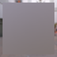
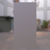
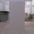
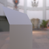
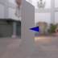
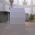
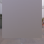

These models are intended to test using skin joints and weights.  

The following table shows the properties that are set for a given model.  

|   | Sample Image | Description |
| :---: | :---: | :---: |
| [00](Animation_Skin_00.gltf) [View](https://bghgary.github.io/glTF-Assets-Viewer/?folder=2&model=0) |  | `skinA`. |
| [01](Animation_Skin_01.gltf) [View](https://bghgary.github.io/glTF-Assets-Viewer/?folder=2&model=1) |  | `skinA` where `Joint1` is animating with a rotation. |
| [02](Animation_Skin_02.gltf) [View](https://bghgary.github.io/glTF-Assets-Viewer/?folder=2&model=2) |  | `skinA` where the skinned node has a transform and a parent node with a transform. Both transforms should be ignored. |
| [03](Animation_Skin_03.gltf) [View](https://bghgary.github.io/glTF-Assets-Viewer/?folder=2&model=3) |  | `skinA`. The skin joints are not referenced by the scene nodes. |
| [04](Animation_Skin_04.gltf) [View](https://bghgary.github.io/glTF-Assets-Viewer/?folder=2&model=4) |  | `skinA` without inverse bind matrices. |
| [05](Animation_Skin_05.gltf) [View](https://bghgary.github.io/glTF-Assets-Viewer/?folder=2&model=5) |  | `skinA` where `Joint1` is animated with a rotation and `Joint1` has a triangle mesh attached to it. |
| [06](Animation_Skin_06.gltf) [View](https://bghgary.github.io/glTF-Assets-Viewer/?folder=2&model=6) |  | `skinB` where `Joint1` is animating with a rotation. |
| [07](Animation_Skin_07.gltf) [View](https://bghgary.github.io/glTF-Assets-Viewer/?folder=2&model=7) |  | `skinC` where all of the joints have a local rotation of ~-10 degrees, except the root which is rotated ~-90 degrees. |
| [08](Animation_Skin_08.gltf) [View](https://bghgary.github.io/glTF-Assets-Viewer/?folder=2&model=8) |  | `skinD` where each joint is animating with a rotation. There is a transform node in the joint hierarchy that is not a joint. That node has a mesh attached to it in order to show its location. |
| [09](Animation_Skin_09.gltf) [View](https://bghgary.github.io/glTF-Assets-Viewer/?folder=2&model=9) |  | `skinE`. |
 
