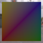

These models are intended to test using an interleaved buffer.  

All values of Byte and Short are normalized unsigned.  

The following table shows the properties that are set for every model.  

| Property | **Values** |
| :---: | :---: |
| Base Color Texture |  |

The following table shows the properties that are set for a given model.  

|   | Sample Image | Vertex UV 0 | Vertex Color |
| :---: | :---: | :---: | :---: |
| [00](Buffer_Interleaved_00.gltf) [View](https://bghgary.github.io/glTF-Asset-Generator/Preview/BabylonJS/?fileName=Buffer_Interleaved_00.gltf) |  | Float | Vector3 Float |
| [01](Buffer_Interleaved_01.gltf) [View](https://bghgary.github.io/glTF-Asset-Generator/Preview/BabylonJS/?fileName=Buffer_Interleaved_01.gltf) |  | Float | Vector3 Byte |
| [02](Buffer_Interleaved_02.gltf) [View](https://bghgary.github.io/glTF-Asset-Generator/Preview/BabylonJS/?fileName=Buffer_Interleaved_02.gltf) |  | Float | Vector3 Short |
| [03](Buffer_Interleaved_03.gltf) [View](https://bghgary.github.io/glTF-Asset-Generator/Preview/BabylonJS/?fileName=Buffer_Interleaved_03.gltf) |  | Byte | Vector3 Float |
| [04](Buffer_Interleaved_04.gltf) [View](https://bghgary.github.io/glTF-Asset-Generator/Preview/BabylonJS/?fileName=Buffer_Interleaved_04.gltf) |  | Short | Vector3 Float |
 
