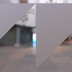
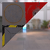

These models are intended to test using multiple instances of a single property.
 
The following table shows the properties that are set for a given model.  

|   | Sample Image | Instanced Mesh | Instanced Material | Instanced Texture |
| :---: | :---: | :---: | :---: | :---: |
| [00](Instancing_00.gltf) [View](https://bghgary.github.io/glTF-Assets-Viewer/?folder=2&model=0) |  | :white_check_mark: |   |   |
| [01](Instancing_01.gltf) [View](https://bghgary.github.io/glTF-Assets-Viewer/?folder=2&model=1) |  |   | :white_check_mark: |   |
| [02](Instancing_02.gltf) [View](https://bghgary.github.io/glTF-Assets-Viewer/?folder=2&model=2) |  |   |   | :white_check_mark: |
 
