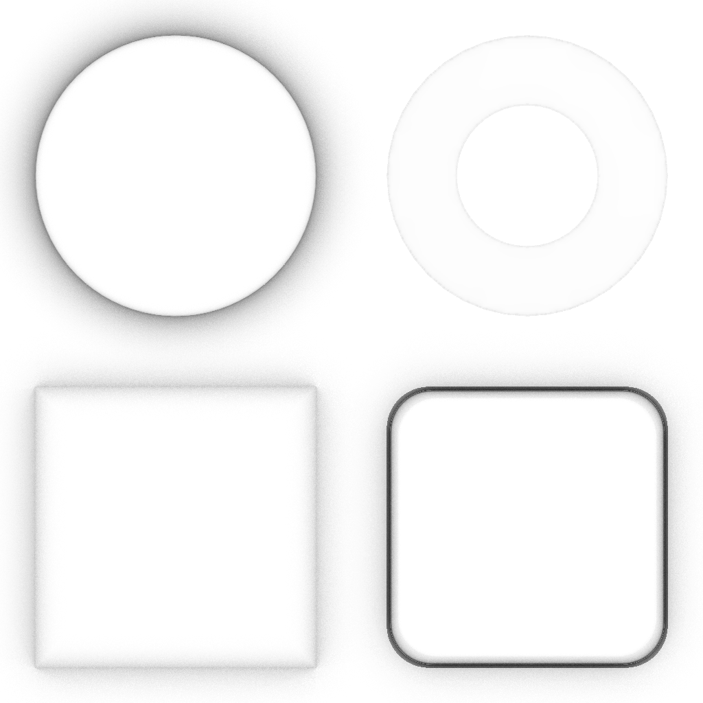

These models are intended to test the various properties that can be set on a material.

The following table shows the properties that are set for every model.

Property | **Values**
:---: | :---:
Metallic Factor | 0.0
Base Color Factor | [0.2f,&nbsp;0.2f,&nbsp;0.2f,&nbsp;1.0f]

The following table shows the properties that are set for a given model.

| | | Emissive Factor | Emissive Texture | Normal Texture | Normal Texture Scale | Occlusion Texture | Occlusion Texture Strength
:---: | :---: | :---: | :---: | :---: | :---: | :---: | :---:
 | [00](Material_00.gltf) [Live](https://sandbox.babylonjs.com/) |   |   |   |   |   |
 | [00](Material_01.gltf) [Live](https://sandbox.babylonjs.com/) | [1.0f,&nbsp;1.0f,&nbsp;1.0f] |  |  | 10.0 |  | 0.5   |
 | [00](Material_02.gltf) [Live](https://sandbox.babylonjs.com/) | [1.0f,&nbsp;1.0f,&nbsp;1.0f] |   |   |   |   |   |
 | [00](Material_03.gltf) [Live](https://sandbox.babylonjs.com/) | [1.0f,&nbsp;1.0f,&nbsp;1.0f] |  |   |   |   |   |
 | [00](Material_04.gltf) [Live](https://sandbox.babylonjs.com/) |   |   |  |   |   |   |
 | [00](Material_05.gltf) [Live](https://sandbox.babylonjs.com/) |   |   |  | 10.0 |   |   |
 | [00](Material_06.gltf) [Live](https://sandbox.babylonjs.com/) |   |   |   |   |  |   |
 | [00](Material_07.gltf) [Live](https://sandbox.babylonjs.com/) |   |   |   |   |  | 0.5   |

