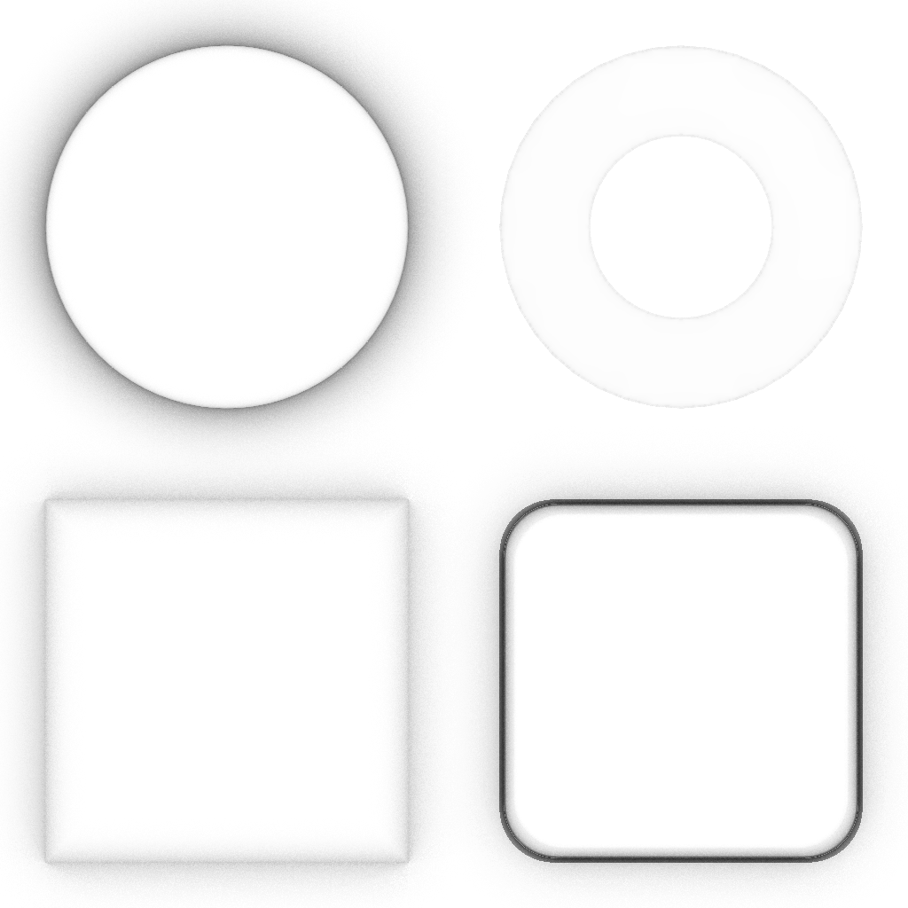

The following table shows the properties that are set for every model.  

Property | **Values**
:---: | :---:
Metallic Factor | 0.0
Base Color Factor | [0.2, 0.2, 0.2, 1]

 
The following table shows the properties that are set for a given model.  

Index | Emissive Factor | Emissive Texture | Normal Texture | Normal Texture Scale | Occlusion Texture | Occlusion Texture Strength
:---: | :---: | :---: | :---: | :---: | :---: | :---:
[00](./Material_00.gltf) |   |   |   |   |   |  
[01](./Material_01.gltf) | [1, 1, 1] |  |  | 10.0 |  | 0.5
[02](./Material_02.gltf) | [1, 1, 1] |   |   |   |   |  
[03](./Material_03.gltf) | [1, 1, 1] |  |   |   |   |  
[04](./Material_04.gltf) |   |   |  |   |   |  
[05](./Material_05.gltf) |   |   |  | 10.0 |   |  
[06](./Material_06.gltf) |   |   |   |   |  |  
[07](./Material_07.gltf) |   |   |   |   |  | 0.5
 
