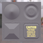

These models are intended to test the various properties that can be set on a material.  

The following table shows the properties that are set for every model.  

| Property | **Values** |
| :---: | :---: |
| Metallic Factor | 0.0 |
| Base Color Factor | [0.2f,&nbsp;0.2f,&nbsp;0.2f,&nbsp;1.0f] |

 
The following table shows the properties that are set for a given model.  

|   | Reference Image | Emissive Factor | Emissive Texture | Normal Texture | Normal Texture Scale | Occlusion Texture | Occlusion Texture Strength |
| :---: | :---: | :---: | :---: | :---: | :---: | :---: | :---: |
| [00](Material_00.gltf) [View](https://bghgary.github.io/glTF-Asset-Generator/Preview/BabylonJS/?fileName=Material_00.gltf) |  |   |   |   |   |   |   |
| [01](Material_01.gltf) [View](https://bghgary.github.io/glTF-Asset-Generator/Preview/BabylonJS/?fileName=Material_01.gltf) |  | [1.0f,&nbsp;1.0f,&nbsp;1.0f] |  |  | 10.0 |  | 0.5 |
| [02](Material_02.gltf) [View](https://bghgary.github.io/glTF-Asset-Generator/Preview/BabylonJS/?fileName=Material_02.gltf) |  | [1.0f,&nbsp;1.0f,&nbsp;1.0f] |   |   |   |   |   |
| [03](Material_03.gltf) [View](https://bghgary.github.io/glTF-Asset-Generator/Preview/BabylonJS/?fileName=Material_03.gltf) |  | [1.0f,&nbsp;1.0f,&nbsp;1.0f] |  |   |   |   |   |
| [04](Material_04.gltf) [View](https://bghgary.github.io/glTF-Asset-Generator/Preview/BabylonJS/?fileName=Material_04.gltf) |  |   |   |  |   |   |   |
| [05](Material_05.gltf) [View](https://bghgary.github.io/glTF-Asset-Generator/Preview/BabylonJS/?fileName=Material_05.gltf) |  |   |   |  | 10.0 |   |   |
| [06](Material_06.gltf) [View](https://bghgary.github.io/glTF-Asset-Generator/Preview/BabylonJS/?fileName=Material_06.gltf) |  |   |   |   |   |  |   |
| [07](Material_07.gltf) [View](https://bghgary.github.io/glTF-Asset-Generator/Preview/BabylonJS/?fileName=Material_07.gltf) |  |   |   |   |   |  | 0.5 |
 
