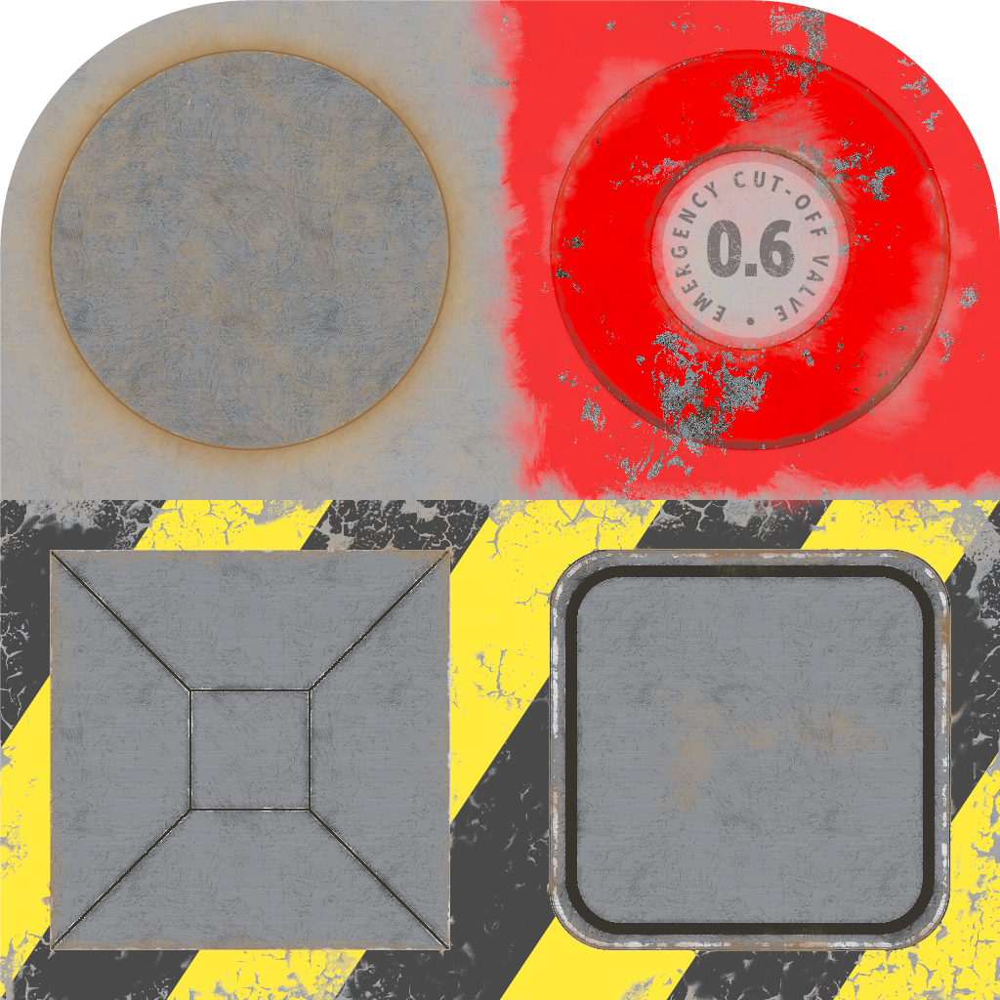

These models are intended to test the various ways that alpha can be set on a material.

No attributes are explicitly set in every model generated by this test, other than those in the base model.  
 
The following table shows the properties that are set for a given model.  

Index | Vertex Color | Alpha Mode | Alpha Cutoff | Double Sided | Base Color Factor | Vertex Normal | Vertex Tangent | Normal Texture | Base Color Texture
:---: | :---: | :---: | :---: | :---: | :---: | :---: | :---: | :---: | :---:
[00](./Material_Alpha_00.gltf) |   |   |   |   |   |   |   |   |  
[01](./Material_Alpha_01.gltf) | Vector4 Float | Mask | 0.6 | True | [1, 1, 1, 0.7] | :white_check_mark: | :white_check_mark: |  | 
[02](./Material_Alpha_02.gltf) |   | Mask |   |   |   |   |   |   | 
[03](./Material_Alpha_03.gltf) |   | Mask |   |   | [1, 1, 1, 0.7] |   |   |   | 
[04](./Material_Alpha_04.gltf) |   | Mask | 0.8 |   | [1, 1, 1, 0.7] |   |   |   | 
[05](./Material_Alpha_05.gltf) |   | Mask | 0.7 |   | [1, 1, 1, 0.7] |   |   |   | 
[06](./Material_Alpha_06.gltf) |   | Mask | 0.6 |   | [1, 1, 1, 0.7] |   |   |   | 
[07](./Material_Alpha_07.gltf) |   | Mask | 0.8 |   |   |   |   |   | 
[08](./Material_Alpha_08.gltf) |   | Mask | 0.7 |   |   |   |   |   | 
[09](./Material_Alpha_09.gltf) |   | Mask | 0.6 |   |   |   |   |   | 
[10](./Material_Alpha_10.gltf) |   | Blend |   |   |   |   |   |   | 
[11](./Material_Alpha_11.gltf) |   |   |   | True |   |   |   |   | 
[12](./Material_Alpha_12.gltf) |   | Blend |   | True |   |   |   |   | 
[13](./Material_Alpha_13.gltf) |   | Mask | 0.6 | True |   |   |   |   | 
[14](./Material_Alpha_14.gltf) |   | Blend |   | True |   | :white_check_mark: | :white_check_mark: |  | 
[15](./Material_Alpha_15.gltf) |   | Mask | 0.6 | True |   | :white_check_mark: | :white_check_mark: |  | 
[16](./Material_Alpha_16.gltf) |   |   |   | True |   | :white_check_mark: | :white_check_mark: |  | 
[17](./Material_Alpha_17.gltf) | Vector4 Float | Blend |   |   | [1, 1, 1, 0.7] |   |   |   | 
[18](./Material_Alpha_18.gltf) | Vector4 Float | Blend |   |   |   |   |   |   |  
[19](./Material_Alpha_19.gltf) | Vector4 Float | Mask |   |   |   |   |   |   |  
[20](./Material_Alpha_20.gltf) |   | Blend |   |   | [1, 1, 1, 0.7] |   |   |   |  
[21](./Material_Alpha_21.gltf) |   | Mask |   |   | [1, 1, 1, 0.7] |   |   |   |  
[22](./Material_Alpha_22.gltf) |   | Mask | 0.6 |   | [1, 1, 1, 0.7] |   |   |   |  
[23](./Material_Alpha_23.gltf) |   | Mask | 0.7 |   | [1, 1, 1, 0.7] |   |   |   |  
[24](./Material_Alpha_24.gltf) |   | Mask | 0.8 |   | [1, 1, 1, 0.7] |   |   |   |  
 
