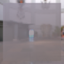
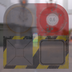
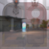

These models are intended to test the various ways that alpha can be set on a material, while alpha mode is set to blend.  

The following table shows the properties that are set for every model.  

| Property | **Values** |
| :---: | :---: |
| Alpha Mode | Blend |

The following table shows the properties that are set for a given model.  

|   | Sample Image | Base Color Texture | Base Color Factor | Vertex Color |
| :---: | :---: | :---: | :---: | :---: |
| [00](Material_AlphaBlend_00.gltf) [View](https://bghgary.github.io/glTF-Asset-Generator/Preview/BabylonJS/?fileName=Material_AlphaBlend_00.gltf) |  |   |   |   |
| [01](Material_AlphaBlend_01.gltf) [View](https://bghgary.github.io/glTF-Asset-Generator/Preview/BabylonJS/?fileName=Material_AlphaBlend_01.gltf) |  |  |   |   |
| [02](Material_AlphaBlend_02.gltf) [View](https://bghgary.github.io/glTF-Asset-Generator/Preview/BabylonJS/?fileName=Material_AlphaBlend_02.gltf) |  |   | [1.0,&nbsp;1.0,&nbsp;1.0,&nbsp;0.7] |   |
| [03](Material_AlphaBlend_03.gltf) [View](https://bghgary.github.io/glTF-Asset-Generator/Preview/BabylonJS/?fileName=Material_AlphaBlend_03.gltf) |  |   |   | Vector4 Float |
| [04](Material_AlphaBlend_04.gltf) [View](https://bghgary.github.io/glTF-Asset-Generator/Preview/BabylonJS/?fileName=Material_AlphaBlend_04.gltf) |  |  | [1.0,&nbsp;1.0,&nbsp;1.0,&nbsp;0.7] |   |
| [05](Material_AlphaBlend_05.gltf) [View](https://bghgary.github.io/glTF-Asset-Generator/Preview/BabylonJS/?fileName=Material_AlphaBlend_05.gltf) |  |  |   | Vector4 Float |
| [06](Material_AlphaBlend_06.gltf) [View](https://bghgary.github.io/glTF-Asset-Generator/Preview/BabylonJS/?fileName=Material_AlphaBlend_06.gltf) |  |   | [1.0,&nbsp;1.0,&nbsp;1.0,&nbsp;0.7] | Vector4 Float |
| [07](Material_AlphaBlend_07.gltf) [View](https://bghgary.github.io/glTF-Asset-Generator/Preview/BabylonJS/?fileName=Material_AlphaBlend_07.gltf) |  |  | [1.0,&nbsp;1.0,&nbsp;1.0,&nbsp;0.7] | Vector4 Float |
 
