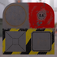
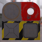

These models are intended to test the various ways that alpha can be set on a material, while Alpha mode is set to mask.  

The following table shows the properties that are set for every model.  

| Property | **Values** |
| :---: | :---: |
| Alpha Mode | Mask |

The following table shows the properties that are set for a given model.  

|   | Sample Image | Base Color Texture | Alpha Cutoff | Base Color Factor |
| :---: | :---: | :---: | :---: | :---: |
| [00](Material_AlphaMask_00.gltf) [View](https://bghgary.github.io/glTF-Asset-Generator/Preview/BabylonJS/?fileName=Material_AlphaMask_00.gltf) |  |   |   |   |
| [01](Material_AlphaMask_01.gltf) [View](https://bghgary.github.io/glTF-Asset-Generator/Preview/BabylonJS/?fileName=Material_AlphaMask_01.gltf) |  |  |   |   |
| [02](Material_AlphaMask_02.gltf) [View](https://bghgary.github.io/glTF-Asset-Generator/Preview/BabylonJS/?fileName=Material_AlphaMask_02.gltf) |  |  | 0.4 |   |
| [03](Material_AlphaMask_03.gltf) [View](https://bghgary.github.io/glTF-Asset-Generator/Preview/BabylonJS/?fileName=Material_AlphaMask_03.gltf) |  |  | 0.7 |   |
| [04](Material_AlphaMask_04.gltf) [View](https://bghgary.github.io/glTF-Asset-Generator/Preview/BabylonJS/?fileName=Material_AlphaMask_04.gltf) |  |  | 1.1 |   |
| [05](Material_AlphaMask_05.gltf) [View](https://bghgary.github.io/glTF-Asset-Generator/Preview/BabylonJS/?fileName=Material_AlphaMask_05.gltf) |  |  | 0.0 |   |
| [06](Material_AlphaMask_06.gltf) [View](https://bghgary.github.io/glTF-Asset-Generator/Preview/BabylonJS/?fileName=Material_AlphaMask_06.gltf) |  |  | 0.4 | [1.0,&nbsp;1.0,&nbsp;1.0,&nbsp;0.7] |
| [07](Material_AlphaMask_07.gltf) [View](https://bghgary.github.io/glTF-Asset-Generator/Preview/BabylonJS/?fileName=Material_AlphaMask_07.gltf) |  |  | 0.5 | [1.0,&nbsp;1.0,&nbsp;1.0,&nbsp;0.7] |
 
