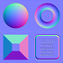

These models are intended to test the various ways that double sided can be set on a material, both with and without normals.

The following table shows the properties that are set for every model.  

| Property | **Values** |
| :---: | :---: |
| Double Sided | True |
| Base Color Texture |  |

 
The following table shows the properties that are set for a given model.  

|   | Sample Image | Vertex Normal | Vertex Tangent | Normal Texture |
| :---: | :---: | :---: | :---: | :---: |
| [00](Material_Doublesided_00.gltf) [View](https://bghgary.github.io/glTF-Asset-Generator/Preview/BabylonJS/?fileName=Material_Doublesided_00.gltf) |  |   |   |   |
| [01](Material_Doublesided_01.gltf) [View](https://bghgary.github.io/glTF-Asset-Generator/Preview/BabylonJS/?fileName=Material_Doublesided_01.gltf) |  | :white_check_mark: |   |   |
| [02](Material_Doublesided_02.gltf) [View](https://bghgary.github.io/glTF-Asset-Generator/Preview/BabylonJS/?fileName=Material_Doublesided_02.gltf) |  | :white_check_mark: |   |  |
| [03](Material_Doublesided_03.gltf) [View](https://bghgary.github.io/glTF-Asset-Generator/Preview/BabylonJS/?fileName=Material_Doublesided_03.gltf) |  | :white_check_mark: | :white_check_mark: |  |
 
