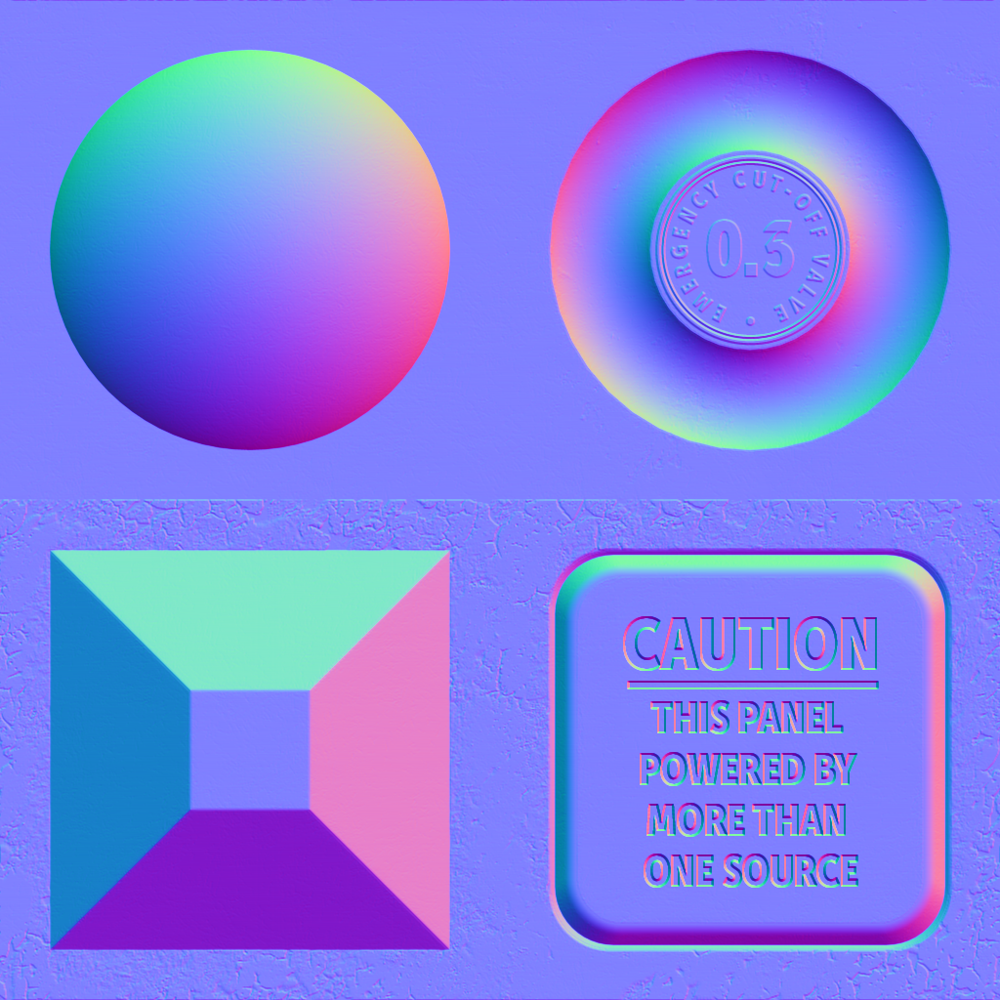

These models are intended to test the various ways that double sided can be set on a material, both with and without normals.

Only the double sided attribute is explicitly set in every model generated by this test, other than those attributes in the base model.  
 
The following table shows the properties that are set for a given model.  

Index | Vertex Normal | Vertex Tangent | Normal Texture | Base Color Texture
:---: | :---: | :---: | :---: | :---:
[00](Material_Doublesided_00.gltf)  |   |   |   | 
[01](Material_Doublesided_01.gltf)  | :white_check_mark: |   |   | 
[02](Material_Doublesided_02.gltf)  | :white_check_mark: |   |  | 
[03](Material_Doublesided_03.gltf)  | :white_check_mark: | :white_check_mark: |  | 
 
