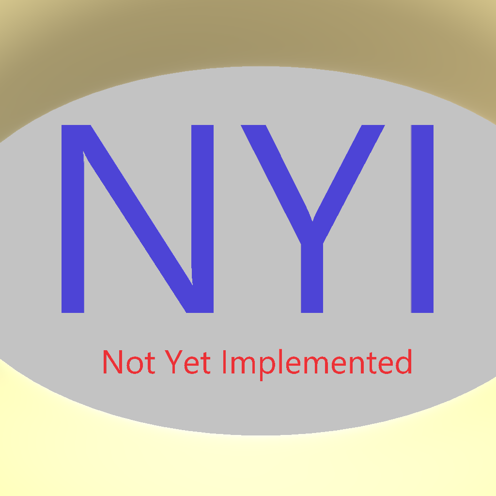

These models are intended to test the various properties of metallic roughness.  
 
The following table shows the properties that are set for a given model.  

Index | Vertex Color | Base Color Texture | Base Color Factor | Metallic Factor | Roughness Factor | Metallic Roughness Texture
:---: | :---: | :---: | :---: | :---: | :---: | :---:
[00](Material_MetallicRoughness_00.gltf)  |   |   |   |   |   |  
[01](Material_MetallicRoughness_01.gltf)  |   |  |   |   |   |  
[02](Material_MetallicRoughness_02.gltf)  |   |   | [0.2f,&nbsp;0.2f,&nbsp;0.2f,&nbsp;0.8f] |   |   |  
[03](Material_MetallicRoughness_03.gltf)  |   |   |   | 0.0 |   |  
[04](Material_MetallicRoughness_04.gltf)  |   |   |   |   | 0.0 |  
[05](Material_MetallicRoughness_05.gltf)  |   |   |   |   |   | 
[06](Material_MetallicRoughness_06.gltf)  | Vector3 Float |  |   |   |   |  
[07](Material_MetallicRoughness_07.gltf)  |   |  | [0.2f,&nbsp;0.2f,&nbsp;0.2f,&nbsp;0.8f] |   |   |  
[08](Material_MetallicRoughness_08.gltf)  |   |   |   | 0.0 |   | 
[09](Material_MetallicRoughness_09.gltf)  |   |   |   |   | 0.0 | 
[10](Material_MetallicRoughness_10.gltf)  | Vector3 Float |  | [0.2f,&nbsp;0.2f,&nbsp;0.2f,&nbsp;0.8f] | 0.0 | 0.0 | 
 
