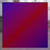
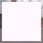
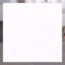
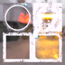

These models are intended to test the various properties of metallic roughness.  
 
The following table shows the properties that are set for a given model.  

|   | Sample Image | Vertex Color | Base Color Texture | Base Color Factor | Metallic Factor | Roughness Factor | Metallic Roughness Texture |
| :---: | :---: | :---: | :---: | :---: | :---: | :---: | :---: |
| [00](Material_MetallicRoughness_00.gltf) [View](https://bghgary.github.io/glTF-Asset-Generator/Preview/BabylonJS/?fileName=Material_MetallicRoughness_00.gltf) |  |   |   |   |   |   |   |
| [01](Material_MetallicRoughness_01.gltf) [View](https://bghgary.github.io/glTF-Asset-Generator/Preview/BabylonJS/?fileName=Material_MetallicRoughness_01.gltf) |  |   |  |   |   |   |   |
| [02](Material_MetallicRoughness_02.gltf) [View](https://bghgary.github.io/glTF-Asset-Generator/Preview/BabylonJS/?fileName=Material_MetallicRoughness_02.gltf) |  |   |   | [0.2f,&nbsp;0.2f,&nbsp;0.2f,&nbsp;0.8f] |   |   |   |
| [03](Material_MetallicRoughness_03.gltf) [View](https://bghgary.github.io/glTF-Asset-Generator/Preview/BabylonJS/?fileName=Material_MetallicRoughness_03.gltf) |  |   |   |   | 0.0 |   |   |
| [04](Material_MetallicRoughness_04.gltf) [View](https://bghgary.github.io/glTF-Asset-Generator/Preview/BabylonJS/?fileName=Material_MetallicRoughness_04.gltf) |  |   |   |   |   | 0.0 |   |
| [05](Material_MetallicRoughness_05.gltf) [View](https://bghgary.github.io/glTF-Asset-Generator/Preview/BabylonJS/?fileName=Material_MetallicRoughness_05.gltf) |  |   |   |   |   |   |  |
| [06](Material_MetallicRoughness_06.gltf) [View](https://bghgary.github.io/glTF-Asset-Generator/Preview/BabylonJS/?fileName=Material_MetallicRoughness_06.gltf) |  | Vector3 Float |  |   |   |   |   |
| [07](Material_MetallicRoughness_07.gltf) [View](https://bghgary.github.io/glTF-Asset-Generator/Preview/BabylonJS/?fileName=Material_MetallicRoughness_07.gltf) |  |   |  | [0.2f,&nbsp;0.2f,&nbsp;0.2f,&nbsp;0.8f] |   |   |   |
| [08](Material_MetallicRoughness_08.gltf) [View](https://bghgary.github.io/glTF-Asset-Generator/Preview/BabylonJS/?fileName=Material_MetallicRoughness_08.gltf) |  |   |   |   | 0.0 |   |  |
| [09](Material_MetallicRoughness_09.gltf) [View](https://bghgary.github.io/glTF-Asset-Generator/Preview/BabylonJS/?fileName=Material_MetallicRoughness_09.gltf) |  |   |   |   |   | 0.0 |  |
| [10](Material_MetallicRoughness_10.gltf) [View](https://bghgary.github.io/glTF-Asset-Generator/Preview/BabylonJS/?fileName=Material_MetallicRoughness_10.gltf) |  | Vector3 Float |  | [0.2f,&nbsp;0.2f,&nbsp;0.2f,&nbsp;0.8f] | 0.0 | 0.0 |  |
 
