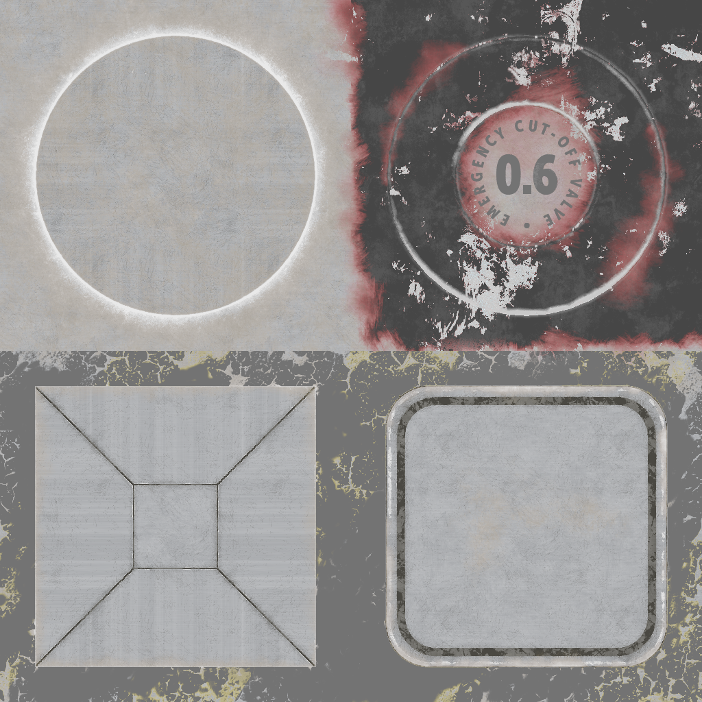

No attributes are explicitly set in every model generated by this test, other than those in the base model.  
 
The following table shows the properties that are set for a given model.  

Index | Vertex Color | Diffuse Factor | Specular Factor | Glossiness Factor | Diffuse Texture | Specular Glossiness Texture
:---: | :---: | :---: | :---: | :---: | :---: | :---:
[00](./Material_SpecularGlossiness_0.gltf) |   |   |   |   |   |  
[01](./Material_SpecularGlossiness_1.gltf) | Vector3 Float | [0.2, 0.2, 0.2, 0.8] | [0.4, 0.4, 0.4] | 0.3 |  | 
[02](./Material_SpecularGlossiness_2.gltf) | Vector3 Float |   | [0.0, 0.0, 0.0] |   |  |  
[03](./Material_SpecularGlossiness_3.gltf) |   |   | [0.0, 0.0, 0.0] |   |  |  
[04](./Material_SpecularGlossiness_4.gltf) |   | [0.2, 0.2, 0.2, 0.8] |   |   |   |  
[05](./Material_SpecularGlossiness_5.gltf) |   | [0.2, 0.2, 0.2, 0.8] | [0.0, 0.0, 0.0] |   |  |  
[06](./Material_SpecularGlossiness_6.gltf) |   |   | [0.4, 0.4, 0.4] |   |   |  
[07](./Material_SpecularGlossiness_7.gltf) |   |   |   | 0.3 |   |  
[08](./Material_SpecularGlossiness_8.gltf) |   |   |   |   |   | 
[09](./Material_SpecularGlossiness_9.gltf) |   |   |   | 0.3 |   | 
[10](./Material_SpecularGlossiness_10.gltf) |   |   | [0.4, 0.4, 0.4] |   |   | 
 
