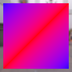
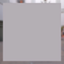
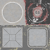
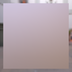
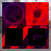
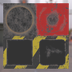
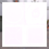
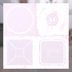

These models are intended to test the various properties of specular glossiness.  

The following table shows the properties that are set for every model.  

The metallic roughness base color texture acts as a fallback when the specular glossiness extension is not supported in the renderer.  

| Property | **Values** |
| :---: | :---: |
| Extension Used | Specular Glossiness |
| Base Color Texture |  |

 
The following table shows the properties that are set for a given model.  

|   | Reference Image | Vertex Color | Diffuse Texture | Diffuse Factor | Specular Factor | Glossiness Factor | Specular Glossiness Texture |
| :---: | :---: | :---: | :---: | :---: | :---: | :---: | :---: |
| [00](Material_SpecularGlossiness_00.gltf) [View](https://bghgary.github.io/glTF-Asset-Generator/Preview/BabylonJS/?fileName=Material_SpecularGlossiness_00.gltf) |  |   |   |   |   |   |   |
| [01](Material_SpecularGlossiness_01.gltf) [View](https://bghgary.github.io/glTF-Asset-Generator/Preview/BabylonJS/?fileName=Material_SpecularGlossiness_01.gltf) |  |   |   | [0.2f,&nbsp;0.2f,&nbsp;0.2f,&nbsp;0.8f] |   |   |   |
| [02](Material_SpecularGlossiness_02.gltf) [View](https://bghgary.github.io/glTF-Asset-Generator/Preview/BabylonJS/?fileName=Material_SpecularGlossiness_02.gltf) |  |   |   |   | [0.4f,&nbsp;0.4f,&nbsp;0.4f] |   |   |
| [03](Material_SpecularGlossiness_03.gltf) [View](https://bghgary.github.io/glTF-Asset-Generator/Preview/BabylonJS/?fileName=Material_SpecularGlossiness_03.gltf) |  |   |   |   |   | 0.3 |   |
| [04](Material_SpecularGlossiness_04.gltf) [View](https://bghgary.github.io/glTF-Asset-Generator/Preview/BabylonJS/?fileName=Material_SpecularGlossiness_04.gltf) |  |   |   |   |   |   |  |
| [05](Material_SpecularGlossiness_05.gltf) [View](https://bghgary.github.io/glTF-Asset-Generator/Preview/BabylonJS/?fileName=Material_SpecularGlossiness_05.gltf) |  |   |  | [0.2f,&nbsp;0.2f,&nbsp;0.2f,&nbsp;0.8f] |   |   |   |
| [06](Material_SpecularGlossiness_06.gltf) [View](https://bghgary.github.io/glTF-Asset-Generator/Preview/BabylonJS/?fileName=Material_SpecularGlossiness_06.gltf) |  |   |  |   | [0.0f,&nbsp;0.0f,&nbsp;0.0f] |   |   |
| [07](Material_SpecularGlossiness_07.gltf) [View](https://bghgary.github.io/glTF-Asset-Generator/Preview/BabylonJS/?fileName=Material_SpecularGlossiness_07.gltf) |  |   |  |   |   | 0.3 |   |
| [08](Material_SpecularGlossiness_08.gltf) [View](https://bghgary.github.io/glTF-Asset-Generator/Preview/BabylonJS/?fileName=Material_SpecularGlossiness_08.gltf) |  |   |   |   | [0.4f,&nbsp;0.4f,&nbsp;0.4f] |   |  |
| [09](Material_SpecularGlossiness_09.gltf) [View](https://bghgary.github.io/glTF-Asset-Generator/Preview/BabylonJS/?fileName=Material_SpecularGlossiness_09.gltf) |  |   |   |   |   | 0.3 |  |
| [10](Material_SpecularGlossiness_10.gltf) [View](https://bghgary.github.io/glTF-Asset-Generator/Preview/BabylonJS/?fileName=Material_SpecularGlossiness_10.gltf) |  | Vector3 Float |  |   | [0.0f,&nbsp;0.0f,&nbsp;0.0f] |   |   |
| [11](Material_SpecularGlossiness_11.gltf) [View](https://bghgary.github.io/glTF-Asset-Generator/Preview/BabylonJS/?fileName=Material_SpecularGlossiness_11.gltf) |  |   |  | [0.2f,&nbsp;0.2f,&nbsp;0.2f,&nbsp;0.8f] | [0.0f,&nbsp;0.0f,&nbsp;0.0f] |   |   |
| [12](Material_SpecularGlossiness_12.gltf) [View](https://bghgary.github.io/glTF-Asset-Generator/Preview/BabylonJS/?fileName=Material_SpecularGlossiness_12.gltf) |  | Vector3 Float |  | [0.2f,&nbsp;0.2f,&nbsp;0.2f,&nbsp;0.8f] | [0.4f,&nbsp;0.4f,&nbsp;0.4f] | 0.3 |  |
 
