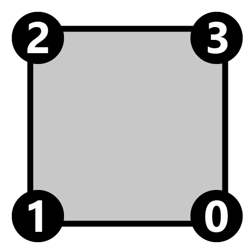

These models are intended to test indices, vertexes without indices, and using mode to render different primitive types.  

All values of Byte, Short, and Int are unsigned.  

All model indices relate to vertices as shown by the following image:  

Indices | 
:---: | 
 |

 

The following table shows the properties that are set for a given model.  

|   | Reference Image | Mode | Indices Values | Indices Component Type
:---: | :---: | :---: | :---: | :---:
[00](Mesh_Indices_00.gltf) [View](https://sandbox.babylonjs.com/) |  | Points |   |  
[01](Mesh_Indices_01.gltf) [View](https://sandbox.babylonjs.com/) |  | Lines |   |  
[02](Mesh_Indices_02.gltf) [View](https://sandbox.babylonjs.com/) |  | Line Loop |   |  
[03](Mesh_Indices_03.gltf) [View](https://sandbox.babylonjs.com/) |  | Line Strip |   |  
[04](Mesh_Indices_04.gltf) [View](https://sandbox.babylonjs.com/) |  | Triangle Strip |   |  
[05](Mesh_Indices_05.gltf) [View](https://sandbox.babylonjs.com/) |  | Triangle Fan |   |  
[06](Mesh_Indices_06.gltf) [View](https://sandbox.babylonjs.com/) |  | Triangles |   |  
[07](Mesh_Indices_07.gltf) [View](https://sandbox.babylonjs.com/) |  | Points | [0, 3, 2, 1] | Int
[08](Mesh_Indices_08.gltf) [View](https://sandbox.babylonjs.com/) |  | Lines | [0, 3, 3, 2, 2, 1, 1, 0] | Int
[09](Mesh_Indices_09.gltf) [View](https://sandbox.babylonjs.com/) |  | Line Loop | [0, 3, 2, 1] | Int
[10](Mesh_Indices_10.gltf) [View](https://sandbox.babylonjs.com/) |  | Line Strip | [0, 3, 2, 1, 0] | Int
[11](Mesh_Indices_11.gltf) [View](https://sandbox.babylonjs.com/) |  | Triangle Strip | [0, 3, 1, 2] | Int
[12](Mesh_Indices_12.gltf) [View](https://sandbox.babylonjs.com/) |  | Triangle Fan | [0, 3, 2, 1] | Int
[13](Mesh_Indices_13.gltf) [View](https://sandbox.babylonjs.com/) |  | Triangles | [1, 0, 3, 1, 3, 2] | Int
[14](Mesh_Indices_14.gltf) [View](https://sandbox.babylonjs.com/) |  | Triangles | [1, 0, 3, 1, 3, 2] | Short
[15](Mesh_Indices_15.gltf) [View](https://sandbox.babylonjs.com/) |  | Triangles | [1, 0, 3, 1, 3, 2] | Byte
 
