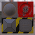
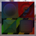

These models are intended to test the various properties that can be applied to a primitive.  

The mesh of the base model is split into two primitives, and then primitive attributes are set on both primitives.  

Primitive 0 Vertex UV Mapping | Primitive 1 Vertex UV Mapping
:---: | :---:
 |  

 

Both primitives are using the same index values, but have different vertex positions.  
They are positioned next to each other so that together they appear to be a square plane.

Indices for Primitive 0 (Left) | Indices for Primitive 1 (Right)
:---: | :---:
 | 

 

The following table shows the properties that are set for a given model.  

|   | Sample Image | Vertex Color | Base Color Texture | Vertex Normal | Vertex Tangent | Normal Texture |
| :---: | :---: | :---: | :---: | :---: | :---: | :---: |
| [00](Mesh_Primitives_00.gltf) [View](https://bghgary.github.io/glTF-Asset-Generator/Preview/BabylonJS/?fileName=Mesh_Primitives_00.gltf) |  |   |   |   |   |   |
| [01](Mesh_Primitives_01.gltf) [View](https://bghgary.github.io/glTF-Asset-Generator/Preview/BabylonJS/?fileName=Mesh_Primitives_01.gltf) |  | :white_check_mark: |   |   |   |   |
| [02](Mesh_Primitives_02.gltf) [View](https://bghgary.github.io/glTF-Asset-Generator/Preview/BabylonJS/?fileName=Mesh_Primitives_02.gltf) |  |   |  |   |   |   |
| [03](Mesh_Primitives_03.gltf) [View](https://bghgary.github.io/glTF-Asset-Generator/Preview/BabylonJS/?fileName=Mesh_Primitives_03.gltf) |  |   |  | :white_check_mark: |   |   |
| [04](Mesh_Primitives_04.gltf) [View](https://bghgary.github.io/glTF-Asset-Generator/Preview/BabylonJS/?fileName=Mesh_Primitives_04.gltf) |  |   |  | :white_check_mark: |   |  |
| [05](Mesh_Primitives_05.gltf) [View](https://bghgary.github.io/glTF-Asset-Generator/Preview/BabylonJS/?fileName=Mesh_Primitives_05.gltf) |  |   |  | :white_check_mark: | :white_check_mark: |  |
| [06](Mesh_Primitives_06.gltf) [View](https://bghgary.github.io/glTF-Asset-Generator/Preview/BabylonJS/?fileName=Mesh_Primitives_06.gltf) |  | :white_check_mark: |  | :white_check_mark: | :white_check_mark: |  |
 
