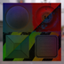

These models are intended to test applying different materials to primitives that are a part of the same mesh.  

Both primitives are using the same index values, but have different vertex positions.  
They are positioned next to each other so that together they appear to be a square plane.  

Indices for Primitive 0 (Left) | Indices for Primitive 1 (Right)
:---: | :---:
 | 

 

The following table shows the properties that are set for a given model.  

|   | Sample Image | Primitive 0 Material 0 Base Color Factor | Primitive 1 Material 0 Base Color Factor | Primitive 0 Material 1 Base Color Factor | Primitive 1 Material 1 Base Color Factor |
| :---: | :---: | :---: | :---: | :---: | :---: |
| [00](Mesh_Primitives_00.gltf) [View](https://bghgary.github.io/glTF-Asset-Generator/Preview/BabylonJS/?fileName=Mesh_Primitives_00.gltf) |  |   |   |   |   |
| [01](Mesh_Primitives_01.gltf) [View](https://bghgary.github.io/glTF-Asset-Generator/Preview/BabylonJS/?fileName=Mesh_Primitives_01.gltf) |  | [0.2,&nbsp;0.8,&nbsp;0.2,&nbsp;0.8] |   |   |   |
| [02](Mesh_Primitives_02.gltf) [View](https://bghgary.github.io/glTF-Asset-Generator/Preview/BabylonJS/?fileName=Mesh_Primitives_02.gltf) |  |   | [0.2,&nbsp;0.8,&nbsp;0.2,&nbsp;0.8] |   |   |
| [03](Mesh_Primitives_03.gltf) [View](https://bghgary.github.io/glTF-Asset-Generator/Preview/BabylonJS/?fileName=Mesh_Primitives_03.gltf) |  |   |   | [0.2,&nbsp;0.2,&nbsp;0.8,&nbsp;0.8] |   |
| [04](Mesh_Primitives_04.gltf) [View](https://bghgary.github.io/glTF-Asset-Generator/Preview/BabylonJS/?fileName=Mesh_Primitives_04.gltf) |  |   |   |   | [0.2,&nbsp;0.2,&nbsp;0.8,&nbsp;0.8] |
| [05](Mesh_Primitives_05.gltf) [View](https://bghgary.github.io/glTF-Asset-Generator/Preview/BabylonJS/?fileName=Mesh_Primitives_05.gltf) |  | [0.2,&nbsp;0.8,&nbsp;0.2,&nbsp;0.8] | [0.2,&nbsp;0.8,&nbsp;0.2,&nbsp;0.8] |   |   |
| [06](Mesh_Primitives_06.gltf) [View](https://bghgary.github.io/glTF-Asset-Generator/Preview/BabylonJS/?fileName=Mesh_Primitives_06.gltf) |  | [0.2,&nbsp;0.8,&nbsp;0.2,&nbsp;0.8] |   |   | [0.2,&nbsp;0.2,&nbsp;0.8,&nbsp;0.8] |
| [07](Mesh_Primitives_07.gltf) [View](https://bghgary.github.io/glTF-Asset-Generator/Preview/BabylonJS/?fileName=Mesh_Primitives_07.gltf) |  |   | [0.2,&nbsp;0.8,&nbsp;0.2,&nbsp;0.8] | [0.2,&nbsp;0.2,&nbsp;0.8,&nbsp;0.8] |   |
| [08](Mesh_Primitives_08.gltf) [View](https://bghgary.github.io/glTF-Asset-Generator/Preview/BabylonJS/?fileName=Mesh_Primitives_08.gltf) |  |   |   | [0.2,&nbsp;0.2,&nbsp;0.8,&nbsp;0.8] | [0.2,&nbsp;0.2,&nbsp;0.8,&nbsp;0.8] |
 
