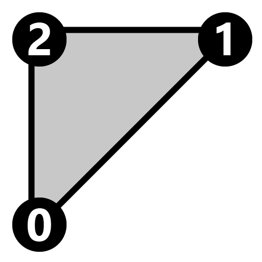
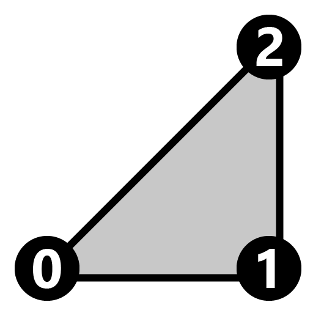

The mesh of the base model is split into two primitives, and then primitive attributes are set on both primitives.  
Otherwise, no attributes are explicitly set in every model generated by this test other than those in the base model.  

Primitive 0 Vertex UV Mapping | Primitive 1 Vertex UV Mapping
:---: | :---:
 |  | 

 

Both primitives are using the same index values, but have different vertex positions.  
They are positioned next to each other so that together they appear to be a square plane.

Indices for Primitive 0 (Left) | Indices for Primitive 1 (Right)
:---: | :---:
 | 

 

The following table shows the properties that are set for a given model.  

Index | Vertex Normal | Vertex Tangent | Vertex Color | Normal Texture | Base Color Texture
:---: | :---: | :---: | :---: | :---: | :---:
[00](./Mesh_Primitives_0.gltf) |   |   |   |   |  
[01](./Mesh_Primitives_1.gltf) | :white_check_mark: | :white_check_mark: | :white_check_mark: |  | 
[02](./Mesh_Primitives_2.gltf) | :white_check_mark: |   |   |   | 
[03](./Mesh_Primitives_3.gltf) | :white_check_mark: | :white_check_mark: |   |  | 
[04](./Mesh_Primitives_4.gltf) |   |   |   |   | 
[05](./Mesh_Primitives_5.gltf) |   |   | :white_check_mark: |   |  
 
