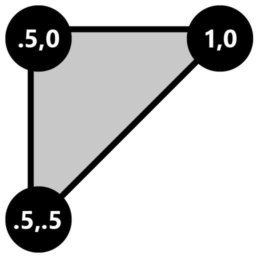
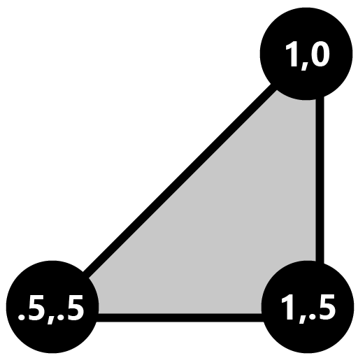

If a UV is set on a primitive, then a material and the following attributes are set on that primitive as well.  
Otherwise, no material or attributes are set on that primitive.

Property | **Values**
:---: | :---:
Vertex Normal | :white_check_mark:
Vertex Tangent | :white_check_mark:
Vertex Color | :white_check_mark:
Normal Texture | 
Base Color Texture | 

 

Both primitives are using the same index values, but have different vertex positions.  
If indices are not used, then the model are assigned unique vertex positions per the primitive mode.  

Indices for Primitive 0 (Left) | Indices for Primitive 1 (Right)
:---: | :---:
 | 

 

The texture applied to a primitive uses Vertex UV 1 if possible. otherwise, Vertex UV 0 is used.  

Primitive 0 Vertex UV 0 Mapping | Primitive 0 Vertex UV 1 Mapping | Primitive 1 Vertex UV 0 Mapping | Primitive 1 Vertex UV 1 Mapping
:---: | :---: | :---: | :---:
 |  |  | 

 

The following table shows the properties that are set for a given model.  

Index | Primitive 0 Vertex UV 0 | Primitive 0 Vertex UV 1 | Primitive 1 Vertex UV 0 | Primitive 1 Vertex UV 1
:---: | :---: | :---: | :---: | :---:
[00](./Mesh_PrimitivesUV_0.gltf) |   |   |   |  
[01](./Mesh_PrimitivesUV_1.gltf) | :white_check_mark: | :white_check_mark: |   |  
[02](./Mesh_PrimitivesUV_2.gltf) | :white_check_mark: |   |   |  
[03](./Mesh_PrimitivesUV_3.gltf) | :white_check_mark: | :white_check_mark: | :white_check_mark: | :white_check_mark:
[04](./Mesh_PrimitivesUV_4.gltf) | :white_check_mark: |   | :white_check_mark: |  
[05](./Mesh_PrimitivesUV_5.gltf) | :white_check_mark: |   | :white_check_mark: | :white_check_mark:
[06](./Mesh_PrimitivesUV_6.gltf) | :white_check_mark: | :white_check_mark: | :white_check_mark: |  
[07](./Mesh_PrimitivesUV_7.gltf) |   |   | :white_check_mark: | :white_check_mark:
[08](./Mesh_PrimitivesUV_8.gltf) |   |   | :white_check_mark: |  
 
