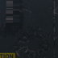
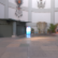

These models are intended to test the basic attributes of node animation.  

The last model on this list creates a curve which doesn't start at Zero.  

The following table shows the properties that are set for a given model.  

|   | Sample Image | Translation | Rotation | Scale | Interpolation |
| :---: | :---: | :---: | :---: | :---: | :---: |
| [00](Node_Animation_00.gltf) [View](https://bghgary.github.io/glTF-Assets-Viewer/?folder=16&model=0) |  | Translation |   |   | Linear |
| [01](Node_Animation_01.gltf) [View](https://bghgary.github.io/glTF-Assets-Viewer/?folder=16&model=1) |  |   | Rotation |   | Linear |
| [02](Node_Animation_02.gltf) [View](https://bghgary.github.io/glTF-Assets-Viewer/?folder=16&model=2) |  |   |   | Scale | Linear |
| [03](Node_Animation_03.gltf) [View](https://bghgary.github.io/glTF-Assets-Viewer/?folder=16&model=3) |  | Translation |   |   | Step |
| [04](Node_Animation_04.gltf) [View](https://bghgary.github.io/glTF-Assets-Viewer/?folder=16&model=4) |  | Translation |   |   | Cubic Spline |
| [05](Node_Animation_05.gltf) [View](https://bghgary.github.io/glTF-Assets-Viewer/?folder=16&model=5) |  |   | Rotation |   | Cubic Spline |
| [06](Node_Animation_06.gltf) [View](https://bghgary.github.io/glTF-Assets-Viewer/?folder=16&model=6) |  | Translation | Rotation | Scale | Linear |
| [07](Node_Animation_07.gltf) [View](https://bghgary.github.io/glTF-Assets-Viewer/?folder=16&model=7) |  |   | Rotation |   | Linear |
 
