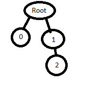

These models are intended to test the basic attributes of the node object.  

The following table shows the properties that are set for every model.  

Property | **Values**
:---: | :---:
Child Nodes | 
Vertex Normal | :white_check_mark:
Vertex Tangent | :white_check_mark:
Normal Texture | 
Base Color Texture | 

The following table shows the properties that are set for a given model.  

Index | Matrix | Translation | Rotation | Scale
:---: | :---: | :---: | :---: | :---:
[00](./Node_Attribute_00.gltf) |   |   |   |  
[01](./Node_Attribute_01.gltf) | T : [3, 3, 3] R : [0.6, 0.6, 0.6] S : [2, 2, 2] |   |   |  
[02](./Node_Attribute_02.gltf) |   | [3, 3, 3] |   |  
[03](./Node_Attribute_03.gltf) |   |   | {X:0.4885018 Y:0.4885018 Z:0.4885018 W:-0.5330084} |  
[04](./Node_Attribute_04.gltf) |   |   |   | [2, 2, 2]
 
