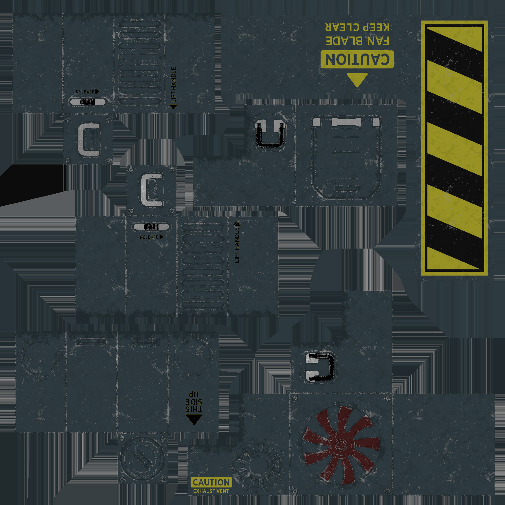

These models are intended to test negative scale transforms on the node object, both with and without specified normals.  

Every model has two nodes. Node 0 is usable as a point of reference, while node 1 is a child where transforms are applied.  

The following table shows the properties that are set for a given model.  

Index | Scale | Matrix | Vertex Normal | Vertex Tangent | Normal Texture | Base Color Texture | Metallic Roughness Texture
:---: | :---: | :---: | :---: | :---: | :---: | :---: | :---:
[00](./Node_NegativeScale_00.gltf) |   |   |   |   |   |   |  
[01](./Node_NegativeScale_01.gltf) |   |   | :white_check_mark: |   |  |  | 
[02](./Node_NegativeScale_02.gltf) |   |   | :white_check_mark: | :white_check_mark: |  |  | 
[03](./Node_NegativeScale_03.gltf) | [-2,&nbsp;1,&nbsp;1] |   |   |   |   |   |  
[04](./Node_NegativeScale_04.gltf) |   | [-2.0f, 0.0f, 0.0f, 0.0f] [0.0f, -2.0f, 0.0f, 0.0f] [0.0f, 0.0f, -2.0f, 0.0f] [0.0f, 0.0f, 0.0f, 1.0f]  |   |   |   |   |  
[05](./Node_NegativeScale_05.gltf) | [-2,&nbsp;1,&nbsp;1] |   | :white_check_mark: |   |  |  | 
[06](./Node_NegativeScale_06.gltf) |   | [-2.0f, 0.0f, 0.0f, 0.0f] [0.0f, -2.0f, 0.0f, 0.0f] [0.0f, 0.0f, -2.0f, 0.0f] [0.0f, 0.0f, 0.0f, 1.0f]  | :white_check_mark: |   |  |  | 
[07](./Node_NegativeScale_07.gltf) | [-2,&nbsp;1,&nbsp;1] |   | :white_check_mark: | :white_check_mark: |  |  | 
[08](./Node_NegativeScale_08.gltf) |   | [-2.0f, 0.0f, 0.0f, 0.0f] [0.0f, -2.0f, 0.0f, 0.0f] [0.0f, 0.0f, -2.0f, 0.0f] [0.0f, 0.0f, 0.0f, 1.0f]  | :white_check_mark: | :white_check_mark: |  |  | 
 
