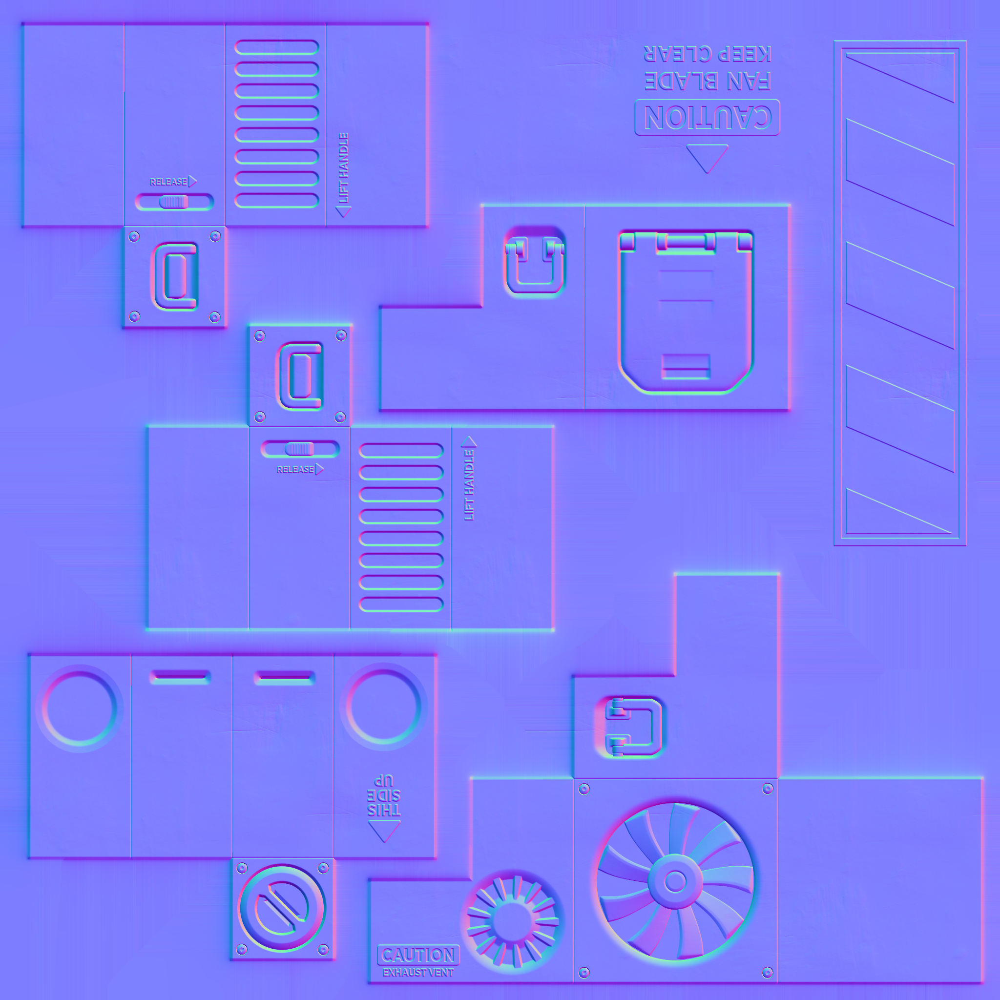

These models are intended to test negative scale transforms on the node object, both with and without specified normals.  

Every model has two nodes. Node 0 is usable as a point of reference, while node 1 is a child where transforms are applied.  

The following table shows the properties that are set for a given model.  

Index | Scale | Matrix | Vertex Normal | Vertex Tangent | Normal Texture | Base Color Texture | Metallic Roughness Texture
:---: | :---: | :---: | :---: | :---: | :---: | :---: | :---:
[00](Node_NegativeScale_00.gltf)  |   |   |   |   |   |   |  
[01](Node_NegativeScale_01.gltf)  |   |   | :white_check_mark: |   |  |  | 
[02](Node_NegativeScale_02.gltf)  |   |   | :white_check_mark: | :white_check_mark: |  |  | 
[03](Node_NegativeScale_03.gltf)  | [-2.0f,&nbsp;1.0f,&nbsp;1.0f] |   |   |   |   |   |  
[04](Node_NegativeScale_04.gltf)  |   | [-2.0f,&nbsp;0.0f,&nbsp;0.0f,&nbsp;0.0f] [0.0f,&nbsp;1.0f,&nbsp;0.0f,&nbsp;0.0f] [0.0f,&nbsp;0.0f,&nbsp;1.0f,&nbsp;0.0f] [0.0f,&nbsp;0.0f,&nbsp;0.0f,&nbsp;1.0f]  |   |   |   |   |  
[05](Node_NegativeScale_05.gltf)  | [-2.0f,&nbsp;1.0f,&nbsp;1.0f] |   | :white_check_mark: |   |  |  | 
[06](Node_NegativeScale_06.gltf)  |   | [-2.0f,&nbsp;0.0f,&nbsp;0.0f,&nbsp;0.0f] [0.0f,&nbsp;1.0f,&nbsp;0.0f,&nbsp;0.0f] [0.0f,&nbsp;0.0f,&nbsp;1.0f,&nbsp;0.0f] [0.0f,&nbsp;0.0f,&nbsp;0.0f,&nbsp;1.0f]  | :white_check_mark: |   |  |  | 
[07](Node_NegativeScale_07.gltf)  | [-2.0f,&nbsp;1.0f,&nbsp;1.0f] |   | :white_check_mark: | :white_check_mark: |  |  | 
[08](Node_NegativeScale_08.gltf)  |   | [-2.0f,&nbsp;0.0f,&nbsp;0.0f,&nbsp;0.0f] [0.0f,&nbsp;1.0f,&nbsp;0.0f,&nbsp;0.0f] [0.0f,&nbsp;0.0f,&nbsp;1.0f,&nbsp;0.0f] [0.0f,&nbsp;0.0f,&nbsp;0.0f,&nbsp;1.0f]  | :white_check_mark: | :white_check_mark: |  |  | 
 
