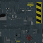
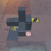
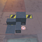

These models are intended to test negative scale transforms on the node object, both with and without specified normals.  

Every model has two nodes. Node 0 is usable as a point of reference, while node 1 is a child where transforms are applied.  

The following table shows the properties that are set for a given model.  

|   | Reference Image | Scale | Matrix | Vertex Normal | Vertex Tangent | Normal Texture | Base Color Texture | Metallic Roughness Texture |
| :---: | :---: | :---: | :---: | :---: | :---: | :---: | :---: | :---: |
| [00](Node_NegativeScale_00.gltf) [View](https://bghgary.github.io/glTF-Asset-Generator/Preview/BabylonJS/?fileName=Node_NegativeScale_00.gltf) |  |   |   |   |   |   |   |   |
| [01](Node_NegativeScale_01.gltf) [View](https://bghgary.github.io/glTF-Asset-Generator/Preview/BabylonJS/?fileName=Node_NegativeScale_01.gltf) |  |   |   | :white_check_mark: |   |  |  |  |
| [02](Node_NegativeScale_02.gltf) [View](https://bghgary.github.io/glTF-Asset-Generator/Preview/BabylonJS/?fileName=Node_NegativeScale_02.gltf) |  |   |   | :white_check_mark: | :white_check_mark: |  |  |  |
| [03](Node_NegativeScale_03.gltf) [View](https://bghgary.github.io/glTF-Asset-Generator/Preview/BabylonJS/?fileName=Node_NegativeScale_03.gltf) |  | [-2.0f,&nbsp;1.0f,&nbsp;1.0f] |   |   |   |   |   |   |
| [04](Node_NegativeScale_04.gltf) [View](https://bghgary.github.io/glTF-Asset-Generator/Preview/BabylonJS/?fileName=Node_NegativeScale_04.gltf) |  |   | [-2.0f,&nbsp;0.0f,&nbsp;0.0f,&nbsp;0.0f] [0.0f,&nbsp;1.0f,&nbsp;0.0f,&nbsp;0.0f] [0.0f,&nbsp;0.0f,&nbsp;1.0f,&nbsp;0.0f] [0.0f,&nbsp;0.0f,&nbsp;0.0f,&nbsp;1.0f]  |   |   |   |   |   |
| [05](Node_NegativeScale_05.gltf) [View](https://bghgary.github.io/glTF-Asset-Generator/Preview/BabylonJS/?fileName=Node_NegativeScale_05.gltf) |  | [-2.0f,&nbsp;1.0f,&nbsp;1.0f] |   | :white_check_mark: |   |  |  |  |
| [06](Node_NegativeScale_06.gltf) [View](https://bghgary.github.io/glTF-Asset-Generator/Preview/BabylonJS/?fileName=Node_NegativeScale_06.gltf) |  |   | [-2.0f,&nbsp;0.0f,&nbsp;0.0f,&nbsp;0.0f] [0.0f,&nbsp;1.0f,&nbsp;0.0f,&nbsp;0.0f] [0.0f,&nbsp;0.0f,&nbsp;1.0f,&nbsp;0.0f] [0.0f,&nbsp;0.0f,&nbsp;0.0f,&nbsp;1.0f]  | :white_check_mark: |   |  |  |  |
| [07](Node_NegativeScale_07.gltf) [View](https://bghgary.github.io/glTF-Asset-Generator/Preview/BabylonJS/?fileName=Node_NegativeScale_07.gltf) |  | [-2.0f,&nbsp;1.0f,&nbsp;1.0f] |   | :white_check_mark: | :white_check_mark: |  |  |  |
| [08](Node_NegativeScale_08.gltf) [View](https://bghgary.github.io/glTF-Asset-Generator/Preview/BabylonJS/?fileName=Node_NegativeScale_08.gltf) |  |   | [-2.0f,&nbsp;0.0f,&nbsp;0.0f,&nbsp;0.0f] [0.0f,&nbsp;1.0f,&nbsp;0.0f,&nbsp;0.0f] [0.0f,&nbsp;0.0f,&nbsp;1.0f,&nbsp;0.0f] [0.0f,&nbsp;0.0f,&nbsp;0.0f,&nbsp;1.0f]  | :white_check_mark: | :white_check_mark: |  |  |  |
 
