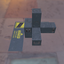

These models are intended to test negative scale transforms on the node object, both with and without specified normals.  

The following table shows the properties that are set for every model.  

| Property | **Values** |
| :---: | :---: |
| Base Color Texture |  |
| Vertex Normal | :white_check_mark: |
| Normal Texture |  |
| Metallic Roughness Texture |  |

 

Every model has two nodes. Node 0 is usable as a point of reference, while node 1 is a child where transforms are applied.  

The following table shows the properties that are set for a given model.  

|   | Sample Image | Scale | Matrix | Vertex Tangent |
| :---: | :---: | :---: | :---: | :---: |
| [00](Node_NegativeScale_00.gltf) [View](https://bghgary.github.io/glTF-Asset-Generator/Preview/BabylonJS/?fileName=Node_NegativeScale_00.gltf) |  |   |   |   |
| [01](Node_NegativeScale_01.gltf) [View](https://bghgary.github.io/glTF-Asset-Generator/Preview/BabylonJS/?fileName=Node_NegativeScale_01.gltf) |  | [1.0,&nbsp;-2.0,&nbsp;1.0] |   |   |
| [02](Node_NegativeScale_02.gltf) [View](https://bghgary.github.io/glTF-Asset-Generator/Preview/BabylonJS/?fileName=Node_NegativeScale_02.gltf) |  |   | [1.0,&nbsp;0.0,&nbsp;0.0,&nbsp;0.0] [0.0,&nbsp;-2.0,&nbsp;0.0,&nbsp;0.0] [0.0,&nbsp;0.0,&nbsp;1.0,&nbsp;0.0] [0.0,&nbsp;0.0,&nbsp;0.0,&nbsp;1.0]  |   |
| [03](Node_NegativeScale_03.gltf) [View](https://bghgary.github.io/glTF-Asset-Generator/Preview/BabylonJS/?fileName=Node_NegativeScale_03.gltf) |  | [1.0,&nbsp;-2.0,&nbsp;1.0] |   | :white_check_mark: |
| [04](Node_NegativeScale_04.gltf) [View](https://bghgary.github.io/glTF-Asset-Generator/Preview/BabylonJS/?fileName=Node_NegativeScale_04.gltf) |  |   | [1.0,&nbsp;0.0,&nbsp;0.0,&nbsp;0.0] [0.0,&nbsp;-2.0,&nbsp;0.0,&nbsp;0.0] [0.0,&nbsp;0.0,&nbsp;1.0,&nbsp;0.0] [0.0,&nbsp;0.0,&nbsp;0.0,&nbsp;1.0]  | :white_check_mark: |
 
