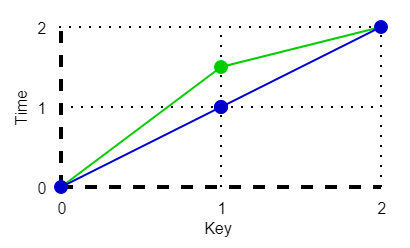
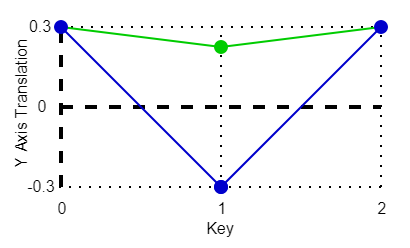
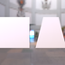
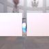

These models are intended to test the use of sparse accessors.  

The "B" mesh is using a sparse accessor that is initialized by the accessor used by the "A" mesh.  

In the following table, green signifies the sparse accessor once it has been initialized.  

|   | Accessor before and after being modified by sparse |
| :---: | :---: |
| Figure 1 Input |  |
| Figure 2 Output |  |  

The following table shows the properties that are set for a given model.  

|   | Sample Image | Sparse Accessor | Description |
| :---: | :---: | :---: | :---: |
| [00](Accessor_Sparse_00.gltf) [View](https://bghgary.github.io/glTF-Assets-Viewer/?type=Positive&folder=26&model=0) |  | Animation Sampler Input | See Figure 1 |
| [01](Accessor_Sparse_01.gltf) [View](https://bghgary.github.io/glTF-Assets-Viewer/?type=Positive&folder=26&model=1) |  | Animation Sampler Output | See Figure 2 |
| [02](Accessor_Sparse_02.gltf) [View](https://bghgary.github.io/glTF-Assets-Viewer/?type=Positive&folder=26&model=2) |  | Positions | Mesh B's sparse accessor overwrites the values of the top left and bottom right vertexes. |
| [03](Accessor_Sparse_03.gltf) [View](https://bghgary.github.io/glTF-Assets-Viewer/?type=Positive&folder=26&model=3) |  | Mesh Primitive Indices | Both meshes have six vertexes, but only four are used to make the visible mesh. Mesh B's sparse accessor replaces the indices pointing at the top left and bottom right vertexes with ones pointing at the unused vertexes. |
 
