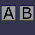

These models are intended to test the use of sparse accessors.  
 
The following table shows the properties that are set for a given model.  

|   | Sample Image | Sparse Accessor |
| :---: | :---: | :---: |
| [00](Accessor_Sparse_00.gltf) [View](https://bghgary.github.io/glTF-Assets-Viewer/?type=Positive&folder=25&model=0) |  | Animation Sampler Input |
| [01](Accessor_Sparse_01.gltf) [View](https://bghgary.github.io/glTF-Assets-Viewer/?type=Positive&folder=25&model=1) |  | Animation Sampler Output |
| [02](Accessor_Sparse_02.gltf) [View](https://bghgary.github.io/glTF-Assets-Viewer/?type=Positive&folder=25&model=2) |  | Positions |
| [03](Accessor_Sparse_03.gltf) [View](https://bghgary.github.io/glTF-Assets-Viewer/?type=Positive&folder=25&model=3) |  | Mesh Primitive Indices |
 
