These models are intended to test the use of sparse accessors.  

Two animation channels are used, one for each visible mesh. The animation sampler referenced by the channel targeting the mesh positioned to the camera's right uses a sparse accessor. For the models that have a checkmark under the "Buffer View" column below, this sparse accessor is initialized from the accessor targeted by the animation channel applied to the mesh on the camera's left.

|   | Base Accessor | Sparse Accessor | Sparse initialized from base |
| :---: | :---: | :---: | :---: |
| Input | 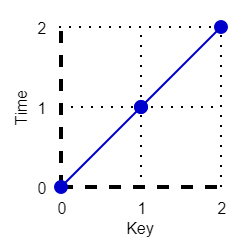 | 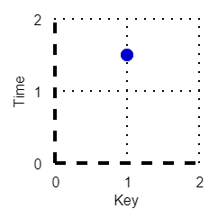 | 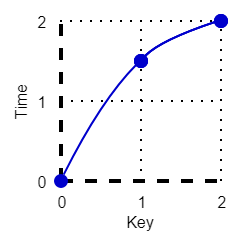 |
| Output - Transform | 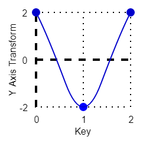 | 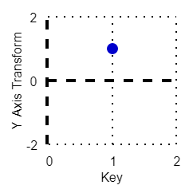 | 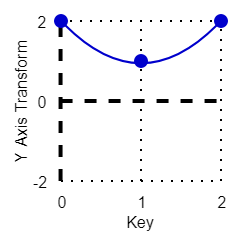 |
| Output - Rotation | 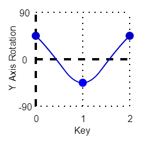 | 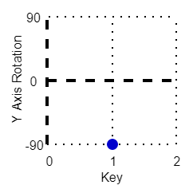 | 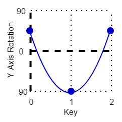 |
| No Buffer View | 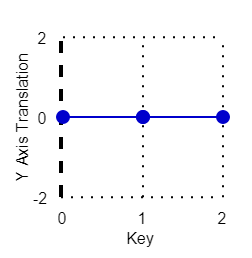 | 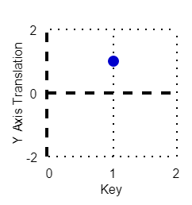 | 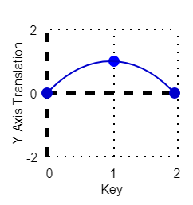 |  

The following table shows the properties that are set for a given model.  

|   | Sample Image | Indices Type | Value Type | Sparse Accessor | Buffer View |
| :---: | :---: | :---: | :---: | :---: | :---: |
| [00](Accessor_SparseType_00.gltf) [View](https://bghgary.github.io/glTF-Assets-Viewer/?type=Positive&folder=26&model=0) |  | Unsigned Int | Float | Input | :white_check_mark: |
| [01](Accessor_SparseType_01.gltf) [View](https://bghgary.github.io/glTF-Assets-Viewer/?type=Positive&folder=26&model=1) |  | Unsigned Byte | Float | Input | :white_check_mark: |
| [02](Accessor_SparseType_02.gltf) [View](https://bghgary.github.io/glTF-Assets-Viewer/?type=Positive&folder=26&model=2) |  | Unsigned Short | Float | Input | :white_check_mark: |
| [03](Accessor_SparseType_03.gltf) [View](https://bghgary.github.io/glTF-Assets-Viewer/?type=Positive&folder=26&model=3) |  | Unsigned Int | Normalized Byte | Output | :white_check_mark: |
| [04](Accessor_SparseType_04.gltf) [View](https://bghgary.github.io/glTF-Assets-Viewer/?type=Positive&folder=26&model=4) |  | Unsigned Int | Normalized Short | Output | :white_check_mark: |
| [05](Accessor_SparseType_05.gltf) [View](https://bghgary.github.io/glTF-Assets-Viewer/?type=Positive&folder=26&model=5) |  | Unsigned Int | Float | Output |  |
 
