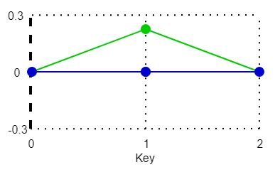

These models are intended to test the various component types that sparse accessors can use.  

The "B" mesh is using a sparse accessor that is initialized by the accessor used by the "A" mesh.
The model that does not reference a buffer view (displays only the "B" mesh) is expected to be initialized from an array of zeros, as per the specification.  

In the following table, green signifies the sparse accessor once it has been initialized.  

|   | Accessor before and after being modified by sparse |
| :---: | :---: |
| Figure 1 Input |  |
| Figure 2 Output |  |
| Figure 3 No Buffer View |  |  

The following table shows the properties that are set for a given model.  

|   | Sample Image | Indices Type | Value Type | Sparse Accessor | Buffer View | Description |
| :---: | :---: | :---: | :---: | :---: | :---: | :---: |
| [00](Accessor_SparseType_00.gltf) [View](https://bghgary.github.io/glTF-Assets-Viewer/?type=Positive&folder=27&model=0) |  | Unsigned Byte | Float | Input | :white_check_mark: | See Figure 1 |
| [01](Accessor_SparseType_01.gltf) [View](https://bghgary.github.io/glTF-Assets-Viewer/?type=Positive&folder=27&model=1) |  | Unsigned Short | Float | Input | :white_check_mark: | See Figure 1 |
| [02](Accessor_SparseType_02.gltf) [View](https://bghgary.github.io/glTF-Assets-Viewer/?type=Positive&folder=27&model=2) |  | Unsigned Int | Float | Input | :white_check_mark: | See Figure 1 |
| [03](Accessor_SparseType_03.gltf) [View](https://bghgary.github.io/glTF-Assets-Viewer/?type=Positive&folder=27&model=3) |  | Unsigned Byte | Normalized Byte | Output | :white_check_mark: | See Figure 2 |
| [04](Accessor_SparseType_04.gltf) [View](https://bghgary.github.io/glTF-Assets-Viewer/?type=Positive&folder=27&model=4) |  | Unsigned Byte | Normalized Short | Output | :white_check_mark: | See Figure 2 |
| [05](Accessor_SparseType_05.gltf) [View](https://bghgary.github.io/glTF-Assets-Viewer/?type=Positive&folder=27&model=5) |  | Unsigned Byte | Unsigned Int | Mesh Primitive Indices | :white_check_mark: | See the description for the Mesh Primitive Indices model in [Accessor_Sparse](../Accessor_Sparse/README.md). |
| [06](Accessor_SparseType_06.gltf) [View](https://bghgary.github.io/glTF-Assets-Viewer/?type=Positive&folder=27&model=6) |  | Unsigned Byte | Float | Output |  | See Figure 3 |
 
