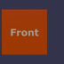
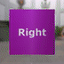
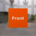
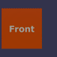
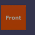

These models are intended to test the basic attributes of an animation on a node.  

The following table shows the properties that are set for a given model.  

|   | Sample Image | Target | Interpolation |
| :---: | :---: | :---: | :---: |
| [00](Animation_Node_00.gltf) [View](https://bghgary.github.io/glTF-Assets-Viewer/?type=Positive&folder=0&model=0) |  | Translation | Linear |
| [01](Animation_Node_01.gltf) [View](https://bghgary.github.io/glTF-Assets-Viewer/?type=Positive&folder=0&model=1) |  | Rotation | Linear |
| [02](Animation_Node_02.gltf) [View](https://bghgary.github.io/glTF-Assets-Viewer/?type=Positive&folder=0&model=2) |  | Scale | Linear |
| [03](Animation_Node_03.gltf) [View](https://bghgary.github.io/glTF-Assets-Viewer/?type=Positive&folder=0&model=3) |  | Translation | Step |
| [04](Animation_Node_04.gltf) [View](https://bghgary.github.io/glTF-Assets-Viewer/?type=Positive&folder=0&model=4) |  | Translation | Cubic Spline |
| [05](Animation_Node_05.gltf) [View](https://bghgary.github.io/glTF-Assets-Viewer/?type=Positive&folder=0&model=5) |  | Rotation | Cubic Spline |
 
