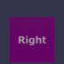
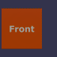
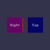
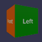
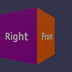

These models are intended to test edge cases of an animation on a node.  

The following table shows the properties that are set for a given model.  

|   | Sample Image | Description |
| :---: | :---: | :---: |
| [00](Animation_NodeMisc_00.gltf) [View](https://bghgary.github.io/glTF-Assets-Viewer/?type=Positive&folder=1&model=0) |  | There are two channels. The first channel targets translation. The second channel targets rotation. The start and end times of both channels are `0.0` and `4.0` respectively. |
| [01](Animation_NodeMisc_01.gltf) [View](https://bghgary.github.io/glTF-Assets-Viewer/?type=Positive&folder=1&model=1) |  | There is one channel with a non-zero start time. The channel targets rotation. The start time is `1.0`. |
| [02](Animation_NodeMisc_02.gltf) [View](https://bghgary.github.io/glTF-Assets-Viewer/?type=Positive&folder=1&model=2) |  | There are two channels with different start and end times. The first channel targets translation with start and end times of `2.0` and `6.0` respectively. The second channel targets rotation with start and end times of `1.0` and `5.0` respectively. |
| [03](Animation_NodeMisc_03.gltf) [View](https://bghgary.github.io/glTF-Assets-Viewer/?type=Positive&folder=1&model=3) |  | There is one channel with only one keyframe. The channel targets translation with a value of <code>[-0.1,&nbsp;0.0,&nbsp;0.0]</code>. |
| [04](Animation_NodeMisc_04.gltf) [View](https://bghgary.github.io/glTF-Assets-Viewer/?type=Positive&folder=1&model=4) |  | There are two channels with different nodes. The first channel targets the left node and rotation along the X axis. The second channel targets the right node and rotation along the Y axis. |
| [05](Animation_NodeMisc_05.gltf) [View](https://bghgary.github.io/glTF-Assets-Viewer/?type=Positive&folder=1&model=5) |  | There is one channel that targets a node. The node has a rotation of <code>[0.0,&nbsp;0.5,&nbsp;0.0,&nbsp;0.866]</code>. The channel overrides the rotation of the node to a different constant value of <code>[0.0,&nbsp;-0.5,&nbsp;0.0,&nbsp;0.866]</code>. |
| [06](Animation_NodeMisc_06.gltf) [View](https://bghgary.github.io/glTF-Assets-Viewer/?type=Positive&folder=1&model=6) |  | There is one channel that targets a node. The node has a rotation of <code>[0.0,&nbsp;0.5,&nbsp;0.0,&nbsp;0.866]</code>. The channel targets the translation of the node. |
| [07](Animation_NodeMisc_07.gltf) [View](https://bghgary.github.io/glTF-Assets-Viewer/?type=Positive&folder=1&model=7) |  | There are two animations, each with one channel. The first animation's channel targets rotation. The second animation's channel targets translation. |
| [08](Animation_NodeMisc_08.gltf) [View](https://bghgary.github.io/glTF-Assets-Viewer/?type=Positive&folder=1&model=8) |  | There are two channels. The first channel has a rotation along the X axis but does not specify a node. The second channel does target the node and has a rotation along the Y axis. |
 
