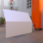
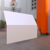

These models are intended to test using different component types with skin joints and weights.  

The following table shows the properties that are set for a given model.  

|   | Sample Image | Joints Component Type | Weight Component Type |
| :---: | :---: | :---: | :---: |
| [00](Animation_SkinType_00.gltf) [View](https://bghgary.github.io/glTF-Assets-Viewer/?folder=3&model=0) |  | Byte | Float |
| [01](Animation_SkinType_01.gltf) [View](https://bghgary.github.io/glTF-Assets-Viewer/?folder=3&model=1) |  | Byte | Byte |
| [02](Animation_SkinType_02.gltf) [View](https://bghgary.github.io/glTF-Assets-Viewer/?folder=3&model=2) |  | Byte | Short |
| [03](Animation_SkinType_03.gltf) [View](https://bghgary.github.io/glTF-Assets-Viewer/?folder=3&model=3) |  | Short | Float |
 
