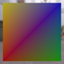

These models are intended to test using an interleaved buffer.  

The following table shows the properties that are set for every model.  

| Property | **Values** |
| :---: | :---: |
| Base Color Texture |  |

The following table shows the properties that are set for a given model.  

|   | Sample Image | Vertex UV 0 | Vertex Color |
| :---: | :---: | :---: | :---: |
| [00](Buffer_Interleaved_00.gltf) [View](https://bghgary.github.io/glTF-Assets-Viewer/?type=Positive&folder=4&model=0) |  | Float | Vector3 Float |
| [01](Buffer_Interleaved_01.gltf) [View](https://bghgary.github.io/glTF-Assets-Viewer/?type=Positive&folder=4&model=1) |  | Float | Vector3 Normalized Unsigned Byte |
| [02](Buffer_Interleaved_02.gltf) [View](https://bghgary.github.io/glTF-Assets-Viewer/?type=Positive&folder=4&model=2) |  | Float | Vector3 Normalized Unsigned Short |
| [03](Buffer_Interleaved_03.gltf) [View](https://bghgary.github.io/glTF-Assets-Viewer/?type=Positive&folder=4&model=3) |  | Normalized Unsigned Byte | Vector3 Float |
| [04](Buffer_Interleaved_04.gltf) [View](https://bghgary.github.io/glTF-Assets-Viewer/?type=Positive&folder=4&model=4) |  | Normalized Unsigned Short | Vector3 Float |
 
