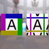
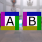
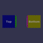

These models are intended to test instancing of various attributes.  
 
The following table shows the properties that are set for a given model.  

|   | Sample Image | Description | Difference |
| :---: | :---: | :---: | :---: |
| [00](Instancing_00.gltf) [View](https://bghgary.github.io/glTF-Assets-Viewer/?type=Positive&folder=24&model=0) |  | Two textures using the same image for the `source` attribute. | The texture sampler attributes `WrapT` and `WrapS` viewed on the left are set as `CLAMP_TO_EDGE`.  The values viewed on the right are `MIRRORED_REPEAT`. |
| [01](Instancing_01.gltf) [View](https://bghgary.github.io/glTF-Assets-Viewer/?type=Positive&folder=24&model=1) |  | Two textures using the same value for the `sampler` attribute. | The `image` viewed on the left is the #1 textures.  Viewed on the right is the #2 texture. |
| [02](Instancing_02.gltf) [View](https://bghgary.github.io/glTF-Assets-Viewer/?type=Positive&folder=24&model=2) |  | Two materials using the same texture `index`. | The material viewed on the left does not have a metallic-roughness `baseColorFactor` set.  The material viewed on the right has a blueish `baseColorFactor`. |
| [03](Instancing_03.gltf) [View](https://bghgary.github.io/glTF-Assets-Viewer/?type=Positive&folder=24&model=3) |  | Two primitives using the same `material` attribute. | The primitive viewed on the left has a `TEXCOORD` value that displays the entire texture.  The value viewed on the right is zoomed in on a corner of the texture. |
| [04](Instancing_04.gltf) [View](https://bghgary.github.io/glTF-Assets-Viewer/?type=Positive&folder=24&model=4) |  | Two primitives using the same accessors for the `POSITION` attribute. | The primitive viewed on the left has a `material` with the #1 texture.  The primitive viewed to the right has a material with the #2 texture. |
| [05](Instancing_05.gltf) [View](https://bghgary.github.io/glTF-Assets-Viewer/?type=Positive&folder=24&model=5) |  | Two primitives using the same accessors for the `indices` attribute. | The primitive viewed to the left has a `material` with the #1 texture.  The primitive viewed to the right has a material with the #2 texture. |
| [06](Instancing_06.gltf) [View](https://bghgary.github.io/glTF-Assets-Viewer/?type=Positive&folder=24&model=6) |  | Two nodes using the same `mesh` attribute. | The node viewed on the left has a `translation` to the left on the X axis.  The node viewed on the right has a `translation` to the right on the X axis. |
| [07](Instancing_07.gltf) [View](https://bghgary.github.io/glTF-Assets-Viewer/?type=Positive&folder=24&model=7) |  | Two nodes using the same `skin` attribute. | The mesh viewed on the left has `POSITION` values further on the left of the X axis.  The mesh viewed to the right has values further on the right of the X axis. |
| [08](Instancing_08.gltf) [View](https://bghgary.github.io/glTF-Assets-Viewer/?type=Positive&folder=24&model=8) |  | Two skins using the same `joints` attributes. | The skin viewed on the left has `inverseBindMatrices` that stand the model up and fold it slightly.  The values viewed on the right are similar, but fold the model twice as much. |
| [09](Instancing_09.gltf) [View](https://bghgary.github.io/glTF-Assets-Viewer/?type=Positive&folder=24&model=9) |  | Two skins using the same `inverseBindMatrices` attribute. | The base joint for the skin viewed on the left has a `translation` to the left along the X axis.  The base joint viewed to the right has a `translation` to the right along the X axis. |
| [10](Instancing_10.gltf) [View](https://bghgary.github.io/glTF-Assets-Viewer/?type=Positive&folder=24&model=10) |  | Two animation channels using the same `sampler` attribute. | The first animation channel targets the node viewed on the left.  The second targets the node viewed on the right. |
| [11](Instancing_11.gltf) [View](https://bghgary.github.io/glTF-Assets-Viewer/?type=Positive&folder=24&model=11) |  | Two animation samplers using the same `input` accessors. | The animation sampler viewed on the left has an output that rotates the model back and forth.  The values viewed on the right also rotates the model, but in the opposite directions. |
| [12](Instancing_12.gltf) [View](https://bghgary.github.io/glTF-Assets-Viewer/?type=Positive&folder=24&model=12) |  | Two animation samplers using the same `output` accessors. | The animation sampler viewed on the left has an input that increaces in a linear fashion.  The animation sampler viewed on the right increaces at a variable rate. |
 
