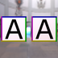
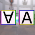

These models are intended to test instancing of various properties.  
 
The following table shows the properties that are set for a given model.  

|   | Sample Image | Description | Difference |
| :---: | :---: | :---: | :---: |
| [00](Instancing_00.gltf) [View](https://bghgary.github.io/glTF-Assets-Viewer/?type=Positive&folder=24&model=0) |  | Two textures using the same image as their source. | The texture sampler `WrapT` and `WrapS` are set to `CLAMP_TO_EDGE` for one and `MIRRORED_REPEAT` for the other. |
| [01](Instancing_01.gltf) [View](https://bghgary.github.io/glTF-Assets-Viewer/?type=Positive&folder=24&model=1) |  | Two textures using the same sampler. | One texture uses image A while the other uses image B. |
| [02](Instancing_02.gltf) [View](https://bghgary.github.io/glTF-Assets-Viewer/?type=Positive&folder=24&model=2) |  | Two textures using the same source image. | One material does not have a baseColorFactor and the other has a blue baseColorFactor. |
| [03](Instancing_03.gltf) [View](https://bghgary.github.io/glTF-Assets-Viewer/?type=Positive&folder=24&model=3) |  | Two primitives using the same material. | One primitive has texture coordinates that displays all of texture A, while the other primitive has textures coordinates that don't display the border. |
| [04](Instancing_04.gltf) [View](https://bghgary.github.io/glTF-Assets-Viewer/?type=Positive&folder=24&model=4) |  | Two primitives using the same accessors for the `POSITION` attribute. | One primitive uses texture A while the other primitive uses texture B. |
| [05](Instancing_05.gltf) [View](https://bghgary.github.io/glTF-Assets-Viewer/?type=Positive&folder=24&model=5) |  | Two primitives using the same accessors for indices. | One primitive uses texture A while the other primitive uses texture B. |
| [06](Instancing_06.gltf) [View](https://bghgary.github.io/glTF-Assets-Viewer/?type=Positive&folder=24&model=6) |  | Two nodes using the same mesh. | The two nodes have different translations. |
| [07](Instancing_07.gltf) [View](https://bghgary.github.io/glTF-Assets-Viewer/?type=Positive&folder=24&model=7) |  | Two nodes using the same mesh. | One node has a [1.0, -1.0, 1.0] scale and the other has a default scale. |
| [08](Instancing_08.gltf) [View](https://bghgary.github.io/glTF-Assets-Viewer/?type=Positive&folder=24&model=8) |  | Two nodes using the same skin. | The two mesh primitives have different `POSITION` values. |
| [09](Instancing_09.gltf) [View](https://bghgary.github.io/glTF-Assets-Viewer/?type=Positive&folder=24&model=9) |  | Two skins using the same joints. | The skin with texture B has inverseBindMatrices that fold twice as far as the skin with texture A. |
| [10](Instancing_10.gltf) [View](https://bghgary.github.io/glTF-Assets-Viewer/?type=Positive&folder=24&model=10) |  | Two skins using the same inverseBindMatrices. | The base joint for the two skins have different translations. |
| [11](Instancing_11.gltf) [View](https://bghgary.github.io/glTF-Assets-Viewer/?type=Positive&folder=24&model=11) |  | Two animation channels using the same sampler. | The two animation channels target different nodes. |
| [12](Instancing_12.gltf) [View](https://bghgary.github.io/glTF-Assets-Viewer/?type=Positive&folder=24&model=12) |  | Two animation samplers using the same input accessors. | The two animation samplers have different output values. |
| [13](Instancing_13.gltf) [View](https://bghgary.github.io/glTF-Assets-Viewer/?type=Positive&folder=24&model=13) |  | Two animation samplers using the same output accessors. | The two animation samplers have different input values. |
 
