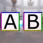
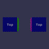

These models are intended to test instancing of various attributes.  
 
The following table shows the properties that are set for a given model.  

|   | Sample Image | Description | Parent Property Difference |
| :---: | :---: | :---: | :---: |
| [00](Instancing_00.gltf) [View](https://bghgary.github.io/glTF-Assets-Viewer/?type=Positive&folder=24&model=0) |  | Two textures using the same image. | Texture sampler `WrapT` is `REPEAT` vs `MIRRORED_REPEAT`. |
| [01](Instancing_01.gltf) [View](https://bghgary.github.io/glTF-Assets-Viewer/?type=Positive&folder=24&model=1) |  | Two materials using the same texture. | One material has a metallic-roughness `baseColorFactor` set. |
| [02](Instancing_02.gltf) [View](https://bghgary.github.io/glTF-Assets-Viewer/?type=Positive&folder=24&model=2) |  | Two primitives using the same material. | Each primitive has a different set of UV texture coordinates. |
| [03](Instancing_03.gltf) [View](https://bghgary.github.io/glTF-Assets-Viewer/?type=Positive&folder=24&model=3) |  | Two primitives using the same accessors for the `POSITION` attribute. | Each primitive has a different set of vertex colors. |
| [04](Instancing_04.gltf) [View](https://bghgary.github.io/glTF-Assets-Viewer/?type=Positive&folder=24&model=4) |  | Two primitives indices using the same accessors. | Each primitive has a different set of vertex colors. |
| [05](Instancing_05.gltf) [View](https://bghgary.github.io/glTF-Assets-Viewer/?type=Positive&folder=24&model=5) |  | Two nodes using the same mesh. | Each node has a different transform. |
| [06](Instancing_06.gltf) [View](https://bghgary.github.io/glTF-Assets-Viewer/?type=Positive&folder=24&model=6) |  | Two nodes using the same skin. | Each node's mesh has different positions and vertex colors. |
| [07](Instancing_07.gltf) [View](https://bghgary.github.io/glTF-Assets-Viewer/?type=Positive&folder=24&model=7) |  | Two skins using the same skeleton. | One skin does not have `inverseBindMatrices` defined. |
| [08](Instancing_08.gltf) [View](https://bghgary.github.io/glTF-Assets-Viewer/?type=Positive&folder=24&model=8) |  | Two skins using the same `inverseBindMatrices`. | Each skin's skeleton has a different transform. |
| [09](Instancing_09.gltf) [View](https://bghgary.github.io/glTF-Assets-Viewer/?type=Positive&folder=24&model=9) |  | Two animation channels using the same samplers. | Each animation channel points at a different node. |
| [10](Instancing_10.gltf) [View](https://bghgary.github.io/glTF-Assets-Viewer/?type=Positive&folder=24&model=10) |  | Two animation samplers using the same `input` accessors. | Different values are used for each sampler's `output`. |
| [11](Instancing_11.gltf) [View](https://bghgary.github.io/glTF-Assets-Viewer/?type=Positive&folder=24&model=11) |  | Two animation samplers sharing the same `output` accessors. | Different values are used for each sampler's `input`. |
 
