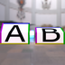

These models are intended to test instancing of various attributes.  
 
The following table shows the properties that are set for a given model.  

|   | Sample Image | Description | Difference |
| :---: | :---: | :---: | :---: |
| [00](Instancing_00.gltf) [View](https://bghgary.github.io/glTF-Assets-Viewer/?type=Positive&folder=24&model=0) |  | Two textures using the same image for the source attribute. | The texture sampler attributes `WrapT` and `WrapS` for A are set as `CLAMP_TO_EDGE`. The values for B are `MIRRORED_REPEAT`. |
| [01](Instancing_01.gltf) [View](https://bghgary.github.io/glTF-Assets-Viewer/?type=Positive&folder=24&model=1) |  | Two textures using the same value for the sampler attribute. | One texture uses the A image while the other uses the B image. |
| [02](Instancing_02.gltf) [View](https://bghgary.github.io/glTF-Assets-Viewer/?type=Positive&folder=24&model=2) |  | Two materials using the same texture index. | One material has a blueish baseColorFactor. |
| [03](Instancing_03.gltf) [View](https://bghgary.github.io/glTF-Assets-Viewer/?type=Positive&folder=24&model=3) |  | Two primitives using the same material attribute. | One primitive has a `TEXCOORD` value that displays the entire A texture, while the value used by the other primitive doesn't display the border. |
| [04](Instancing_04.gltf) [View](https://bghgary.github.io/glTF-Assets-Viewer/?type=Positive&folder=24&model=4) |  | Two primitives using the same accessors for the `POSITION` attribute. | One primitive is using a material with the A texture, while the other primitive uses the B texture. |
| [05](Instancing_05.gltf) [View](https://bghgary.github.io/glTF-Assets-Viewer/?type=Positive&folder=24&model=5) |  | Two primitives using the same accessors for the indices attribute. | One primitive is using a material with the A texture, while the other primitive uses the B texture. |
| [06](Instancing_06.gltf) [View](https://bghgary.github.io/glTF-Assets-Viewer/?type=Positive&folder=24&model=6) |  | Two nodes using the same mesh attribute. | Both nodes have a different translation value. |
| [07](Instancing_07.gltf) [View](https://bghgary.github.io/glTF-Assets-Viewer/?type=Positive&folder=24&model=7) |  | Two nodes using the same skin attribute. | Both meshs have `POSITION` values offset from each other. |
| [08](Instancing_08.gltf) [View](https://bghgary.github.io/glTF-Assets-Viewer/?type=Positive&folder=24&model=8) |  | Two skins using the same joints attributes. | The B textured skin has inverseBindMatrices that fold the model twice as far. |
| [09](Instancing_09.gltf) [View](https://bghgary.github.io/glTF-Assets-Viewer/?type=Positive&folder=24&model=9) |  | Two skins using the same inverseBindMatrices attribute. | The base joint for each skin has a different translation. |
| [10](Instancing_10.gltf) [View](https://bghgary.github.io/glTF-Assets-Viewer/?type=Positive&folder=24&model=10) |  | Two animation channels using the same sampler attribute. | The two animation channels target different nodes. |
| [11](Instancing_11.gltf) [View](https://bghgary.github.io/glTF-Assets-Viewer/?type=Positive&folder=24&model=11) |  | Two animation samplers using the same input accessors. | Each animation sampler has an output that is the reverse of the output used by the other sampler. |
| [12](Instancing_12.gltf) [View](https://bghgary.github.io/glTF-Assets-Viewer/?type=Positive&folder=24&model=12) |  | Two animation samplers using the same output accessors. | Each animation sampler has an input that increases at a different rate than the input of the other sampler. |
 
