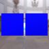
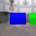
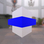

These models are intended to test instantiation, with various attributes being used in multiple instances.  

The following table shows the properties that are set for every model.  

| Property | **Values** |
| :---: | :---: |

 
The following table shows the properties that are set for a given model.  

|   | Sample Image | Description |
| :---: | :---: | :---: |
| [00](Instantiation_00.gltf) [View](https://bghgary.github.io/glTF-Assets-Viewer/?type=Positive&folder=24&model=0) |  | Two textures using the same image. |
| [01](Instantiation_01.gltf) [View](https://bghgary.github.io/glTF-Assets-Viewer/?type=Positive&folder=24&model=1) |  | Two materials using the same texture. |
| [02](Instantiation_02.gltf) [View](https://bghgary.github.io/glTF-Assets-Viewer/?type=Positive&folder=24&model=2) |  | Two primitives using the same material. |
| [03](Instantiation_03.gltf) [View](https://bghgary.github.io/glTF-Assets-Viewer/?type=Positive&folder=24&model=3) |  | Two primitives using the same accessors for the attributes `NORMAL` and `TEXTCOORD`. |
| [04](Instantiation_04.gltf) [View](https://bghgary.github.io/glTF-Assets-Viewer/?type=Positive&folder=24&model=4) |  | Two primitives indices using the same accessors. |
| [05](Instantiation_05.gltf) [View](https://bghgary.github.io/glTF-Assets-Viewer/?type=Positive&folder=24&model=5) |  | Two nodes using the same mesh. |
| [06](Instantiation_06.gltf) [View](https://bghgary.github.io/glTF-Assets-Viewer/?type=Positive&folder=24&model=6) |  | Two nodes using the same skin. |
| [07](Instantiation_07.gltf) [View](https://bghgary.github.io/glTF-Assets-Viewer/?type=Positive&folder=24&model=7) |  | Two skins using the same skeleton. |
| [08](Instantiation_08.gltf) [View](https://bghgary.github.io/glTF-Assets-Viewer/?type=Positive&folder=24&model=8) |  | Two skins using the same inverseBindMatrices. |
| [09](Instantiation_09.gltf) [View](https://bghgary.github.io/glTF-Assets-Viewer/?type=Positive&folder=24&model=9) |  | Two animation channels using the same samplers. |
| [10](Instantiation_10.gltf) [View](https://bghgary.github.io/glTF-Assets-Viewer/?type=Positive&folder=24&model=10) |  | Two animation samplers using the same accessors. |
 
