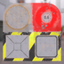
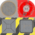
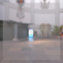
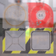

These models are intended to test the various ways that alpha can be set on a material, while alpha mode is set to blend.  

The following table shows the properties that are set for every model.  

| Property | **Values** |
| :---: | :---: |
| Alpha Mode | Blend |

The following table shows the properties that are set for a given model.  

|   | Sample Image | Vertex Color | Base Color Texture | Base Color Factor |
| :---: | :---: | :---: | :---: | :---: |
| [00](Material_AlphaBlend_00.gltf) [View](https://bghgary.github.io/glTF-Assets-Viewer/?type=Positive&folder=7&model=0) |  | Vector4 Float |   |   |
| [01](Material_AlphaBlend_01.gltf) [View](https://bghgary.github.io/glTF-Assets-Viewer/?type=Positive&folder=7&model=1) |  |   |  |   |
| [02](Material_AlphaBlend_02.gltf) [View](https://bghgary.github.io/glTF-Assets-Viewer/?type=Positive&folder=7&model=2) |  |   |   | [1.0,&nbsp;1.0,&nbsp;1.0,&nbsp;0.7] |
| [03](Material_AlphaBlend_03.gltf) [View](https://bghgary.github.io/glTF-Assets-Viewer/?type=Positive&folder=7&model=3) |  | Vector4 Float |  |   |
| [04](Material_AlphaBlend_04.gltf) [View](https://bghgary.github.io/glTF-Assets-Viewer/?type=Positive&folder=7&model=4) |  | Vector4 Float |   | [1.0,&nbsp;1.0,&nbsp;1.0,&nbsp;0.7] |
| [05](Material_AlphaBlend_05.gltf) [View](https://bghgary.github.io/glTF-Assets-Viewer/?type=Positive&folder=7&model=5) |  |   |  | [1.0,&nbsp;1.0,&nbsp;1.0,&nbsp;0.7] |
| [06](Material_AlphaBlend_06.gltf) [View](https://bghgary.github.io/glTF-Assets-Viewer/?type=Positive&folder=7&model=6) |  | Vector4 Float |  | [1.0,&nbsp;1.0,&nbsp;1.0,&nbsp;0.7] |
 
