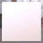
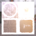
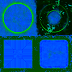
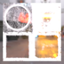

These models are intended to test the various properties of metallic roughness.  
 
The following table shows the properties that are set for a given model.  

|   | Sample Image | Vertex Color | Base Color Texture | Base Color Factor | Metallic Roughness Texture | Metallic Factor | Roughness Factor |
| :---: | :---: | :---: | :---: | :---: | :---: | :---: | :---: |
| [00](Material_MetallicRoughness_00.gltf) [View](https://bghgary.github.io/glTF-Assets-Viewer/?type=Positive&folder=10&model=0) |  |   |   |   |   |   |   |
| [01](Material_MetallicRoughness_01.gltf) [View](https://bghgary.github.io/glTF-Assets-Viewer/?type=Positive&folder=10&model=1) |  | Vector3 Float |   |   |   |   |   |
| [02](Material_MetallicRoughness_02.gltf) [View](https://bghgary.github.io/glTF-Assets-Viewer/?type=Positive&folder=10&model=2) |  |   |  |   |   |   |   |
| [03](Material_MetallicRoughness_03.gltf) [View](https://bghgary.github.io/glTF-Assets-Viewer/?type=Positive&folder=10&model=3) |  |   |   | [0.2,&nbsp;0.2,&nbsp;0.2,&nbsp;0.8] |   |   |   |
| [04](Material_MetallicRoughness_04.gltf) [View](https://bghgary.github.io/glTF-Assets-Viewer/?type=Positive&folder=10&model=4) |  |   |   |   |  |   |   |
| [05](Material_MetallicRoughness_05.gltf) [View](https://bghgary.github.io/glTF-Assets-Viewer/?type=Positive&folder=10&model=5) |  |   |   |   |   | 0.0 |   |
| [06](Material_MetallicRoughness_06.gltf) [View](https://bghgary.github.io/glTF-Assets-Viewer/?type=Positive&folder=10&model=6) |  |   |   |   |   |   | 0.0 |
| [07](Material_MetallicRoughness_07.gltf) [View](https://bghgary.github.io/glTF-Assets-Viewer/?type=Positive&folder=10&model=7) |  | Vector3 Float |  |   |   |   |   |
| [08](Material_MetallicRoughness_08.gltf) [View](https://bghgary.github.io/glTF-Assets-Viewer/?type=Positive&folder=10&model=8) |  |   |  | [0.2,&nbsp;0.2,&nbsp;0.2,&nbsp;0.8] |   |   |   |
| [09](Material_MetallicRoughness_09.gltf) [View](https://bghgary.github.io/glTF-Assets-Viewer/?type=Positive&folder=10&model=9) |  |   |   |   |  | 0.0 |   |
| [10](Material_MetallicRoughness_10.gltf) [View](https://bghgary.github.io/glTF-Assets-Viewer/?type=Positive&folder=10&model=10) |  |   |   |   |  |   | 0.0 |
| [11](Material_MetallicRoughness_11.gltf) [View](https://bghgary.github.io/glTF-Assets-Viewer/?type=Positive&folder=10&model=11) |  | Vector3 Float |  | [0.2,&nbsp;0.2,&nbsp;0.2,&nbsp;0.8] |  | 0.0 | 0.0 |
 
